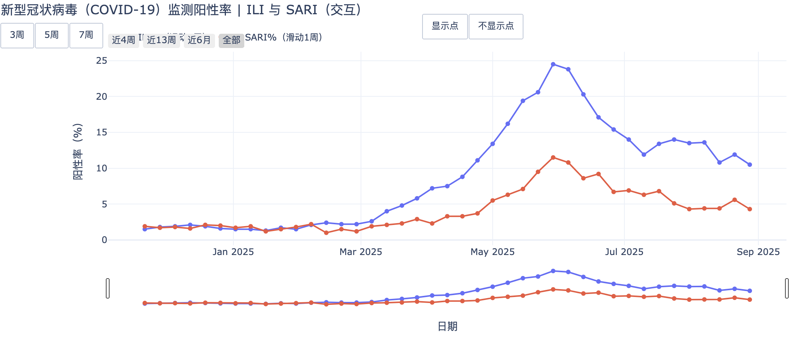

# 中国疾控中心数据爬取与处理工具

[](https://www.python.org/)
[](LICENSE)

本项目是一个专门用于爬取、处理和分析中国疾控中心（CDC）发布的传染病监测数据的自动化工具。该工具可以从中国CDC官网批量下载并处理新冠疫情数据和急性呼吸道传染病监测报告，将其转换为结构化数据用于后续分析。



## 📊 项目概述

本项目主要处理两类数据：
- **新冠疫情数据** (`xgbdyq`)：新型冠状病毒肺炎疫情相关报告
- **急性呼吸道传染病监测数据** (`jksj04_14275`)：全国哨点监测情况报告

## 🚀 主要功能

1. **批量网页抓取**：自动从中国CDC官网批量下载指定页面并保存为PDF
2. **PDF转Markdown**：利用MinerU等OCR服务将PDF文件转换为结构化的Markdown格式
3. **数据提取**：从Markdown文件中智能提取病原体检测数据，输出结构化CSV
4. **可选LLM增强**：支持使用大语言模型提升数据提取的准确性

## 🛠 系统要求

- Python 3.10 或更高版本
- uv 包管理器（推荐）或 pip
- MinerU API 服务器（用于PDF转换）
- OpenRouter API 密钥（可选，用于LLM增强）

## 📦 安装依赖

本项目使用 `uv` 进行依赖管理：

```bash
# 克隆项目
git clone <repository-url>
cd cn_cdc_data

# 安装依赖
uv install
```

如果使用 pip：

```bash
pip install -r requirements.txt
```

主要依赖包括：
- `beautifulsoup4`：HTML解析
- `langchain` & `langchain-openai`：LLM处理
- `pandas`：数据处理
- `playwright`：浏览器自动化
- `requests`：HTTP请求
- `tqdm`：进度条显示

## 🔧 配置说明

### 1. MinerU 服务器配置

本项目需要MinerU API服务器进行PDF到Markdown的转换。默认配置：
```
默认服务器：http://10.22.16.132:8011
支持的格式：PDF → Markdown
```

### 2. OpenRouter API配置（可选）

如需使用LLM增强数据提取准确性：
```bash
export OPENROUTER_API_KEY="your-api-key-here"
```

## 📝 使用方法

### 完整工作流

项目提供了完整的数据处理流水线，可以通过 `run.sh` 脚本查看标准工作流：

#### 1. 急性呼吸道传染病监测数据处理

```bash
# 步骤1: 爬取网页并保存为PDF
uv run save_web_to_pdf.py \
    url_surveillance.txt -o pdf_surveillance \
    --format A1 --margin 10mm \
    -c 6 --wait-until load

# 步骤2: 转换PDF为Markdown
uv run convert_pdf_to_md.py pdf_surveillance -o md_surveillance \
  --server http://10.22.16.132:8011 \
  --lang ch --backend pipeline --parse-method auto \
  --formula-enable true --table-enable true \
  --workers 6 --timeout 180 

# 步骤3: 提取结构化数据
export OPENROUTER_API_KEY="your-api-key"
uv run python extract_data_from_md.py md_surveillance -o cn_cdc_surveillance.csv --no-llm --debug
```

#### 2. 新冠疫情数据处理

```bash
# 爬取并保存PDF
uv run save_web_to_pdf.py \
    url_covid19.txt -o pdf_covid19 \
    --format A1 --margin 10mm \
    -c 6 --wait-until load

# 转换为Markdown
uv run convert_pdf_to_md.py pdf_covid19 -o md_covid19 \
  --server http://10.22.16.132:8011 \
  --lang ch --backend pipeline --parse-method auto \
  --formula-enable true --table-enable true \
  --workers 6 --timeout 180 
```

### 各工具详细说明

#### 1. `save_web_to_pdf.py` - 网页转PDF工具

```bash
uv run save_web_to_pdf.py [URL文件] -o [输出目录] [选项]
```

**主要参数：**
- `input`：URL列表文件（每行一个URL）或逗号分隔的URL字符串
- `-o, --output`：输出目录，默认 `pdf_out`
- `--format`：纸张格式（A4/A1/Letter等），默认 A4
- `--margin`：页边距，默认 10mm
- `-c, --concurrency`：并发数，默认 4
- `-t, --timeout`：单页超时时间（秒），默认 45
- `--wait-until`：页面加载等待策略（load/networkidle/domcontentloaded）

**特色功能：**
- 中文字体优化支持
- 打印友好的页面样式调整
- 自动处理粘性导航栏
- 智能文件命名和去重

#### 2. `convert_pdf_to_md.py` - PDF转Markdown工具

```bash
uv run convert_pdf_to_md.py [PDF路径] -o [输出目录] [选项]
```

**主要参数：**
- `input`：PDF文件、目录或通配符模式
- `-o, --out`：输出目录，默认 `md_out`
- `--server`：MinerU服务器地址
- `--lang`：语言设置，默认 `ch`（中文）
- `--backend`：后端类型，默认 `pipeline`
- `--parse-method`：解析方法，默认 `auto`
- `--formula-enable`：启用公式识别，默认 true
- `--table-enable`：启用表格识别，默认 true
- `--workers`：并发工作线程数，默认 4

#### 3. `extract_data_from_md.py` - 数据提取工具

```bash
uv run python extract_data_from_md.py [Markdown目录] -o [CSV输出] [选项]
```

**主要参数：**
- `input`：Markdown文件目录
- `-o, --output`：输出CSV文件路径
- `--no-llm`：禁用LLM增强（使用基于规则的提取）
- `--debug`：启用调试输出
- `--model`：指定LLM模型，默认 `deepseek/deepseek-chat`
- `--workers`：并发处理数，默认 4

**数据提取规则：**
- 自动识别报告日期和周次信息
- 解析"表1"病原体检测数据
- 支持门急诊流感样病例（ILI）和住院严重急性呼吸道感染（SARI）两类数据
- 智能处理百分比和病例数数据

## 📁 项目结构

```
cn_cdc_data/
├── README.md                    # 本文档
├── pyproject.toml              # 项目配置和依赖
├── run.sh                      # 完整工作流示例脚本
├── 
├── # 核心工具脚本
├── save_web_to_pdf.py          # 网页批量保存为PDF
├── convert_pdf_to_md.py        # PDF转Markdown转换器
├── extract_data_from_md.py     # 结构化数据提取工具
├── 
├── # URL列表文件
├── url_covid19.txt             # 新冠疫情数据URL列表
├── url_surveillance.txt        # 急性呼吸道传染病监测URL列表
├── 
├── # 数据目录
├── pdf_covid19/                # 新冠疫情PDF文件
├── pdf_surveillance/           # 监测数据PDF文件
├── md_covid19/                 # 新冠疫情Markdown文件
├── md_surveillance/            # 监测数据Markdown文件
├── 
└── cn_cdc_surveillance.csv     # 最终输出的结构化数据
```

## 📊 输出数据格式

最终输出的CSV文件包含以下字段：

| 字段名 | 描述 | 示例 |
|--------|------|------|
| `report_date` | 报告发布日期 | 2025-08-28 |
| `report_week` | 报告周次 | 2025-34 |
| `pathogen` | 病原体名称 | 新型冠状病毒 |
| `ili_percent` | 门急诊流感样病例阳性率(%) | 10.5 |
| `sari_percent` | 住院严重急性呼吸道感染病例阳性率(%) | 4.3 |

支持的病原体包括：
- 新型冠状病毒
- 流感病毒
- 呼吸道合胞病毒
- 腺病毒
- 人偏肺病毒
- 副流感病毒
- 普通冠状病毒
- 博卡病毒
- 鼻病毒
- 肠道病毒
- 肺炎支原体

## ⚙️ 高级配置

### 自定义MinerU服务器

如果你有自己的MinerU部署：

```bash
# 方法1：环境变量
export MINERU_API="http://your-mineru-server:port"

# 方法2：命令行参数
uv run convert_pdf_to_md.py input.pdf --server http://your-mineru-server:port
```

### 批处理优化

对于大批量数据处理，建议：

1. **调整并发数**：根据服务器性能调整 `--workers` 和 `--concurrency` 参数
2. **增加超时时间**：复杂PDF可能需要更长处理时间 `--timeout 300`
3. **分批处理**：将大量URL分成小批次处理，避免资源耗尽

### 错误处理和重试

所有工具都支持自动重试机制：
- PDF转换支持失败重试（默认3次）
- 网页抓取支持多种等待策略回退
- 数据提取支持跳过损坏文件继续处理

## 🐛 常见问题

### 1. MinerU连接失败

**问题**：无法连接到MinerU服务器
**解决**：
- 确认MinerU服务正在运行
- 检查防火墙设置
- 验证API端点地址是否正确

### 2. PDF转换质量差

**问题**：转换后的Markdown文件表格混乱
**解决**：
- 启用表格识别：`--table-enable true`
- 调整解析方法：`--parse-method ocr` 或 `--parse-method txt`
- 检查原始PDF质量

### 3. 数据提取不完整

**问题**：CSV输出缺少某些数据行
**解决**：
- 启用调试模式：`--debug`
- 检查Markdown文件中表格格式
- 尝试启用LLM增强提取

### 4. 内存不足

**问题**：处理大量文件时内存耗尽
**解决**：
- 减少并发数：`--workers 2`
- 分批处理文件
- 增加系统虚拟内存

## 🤝 贡献指南

欢迎提交Issue和Pull Request！

1. Fork 本仓库
2. 创建特性分支：`git checkout -b feature/AmazingFeature`
3. 提交修改：`git commit -m 'Add some AmazingFeature'`
4. 推送分支：`git push origin feature/AmazingFeature`
5. 提交Pull Request

## 📄 许可证

本项目采用 MIT 许可证，详见 [LICENSE](LICENSE) 文件。

## 🙏 致谢

- [MinerU](https://github.com/opendatalab/MinerU) - 强大的PDF解析工具
- [Playwright](https://playwright.dev/) - 现代浏览器自动化
- [LangChain](https://python.langchain.com/) - LLM应用开发框架
- 中国疾病预防控制中心 - 数据源

## 📮 联系方式

如有问题或建议，请通过以下方式联系：

- 提交GitHub Issue
- 发送邮件至：[yang_kaixin@gzlab.ac.cn]

---

**免责声明**：本工具仅用于学术研究和个人学习目的。使用时请遵守中国疾控中心网站的使用条款和相关法律法规。请合理使用爬虫工具，避免对目标网站造成过大负担。
