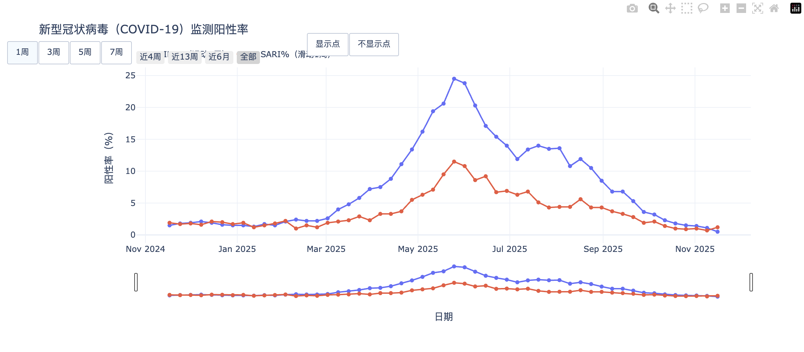

# 中国 CDC 哨点医院监测数据同步工具

[](https://www.python.org/)
[](LICENSE)

本工具用于自动同步和处理中国疾病预防控制中心（CDC）哨点医院监测数据。支持从 CDC 官网批量下载监测报告，转换为结构化数据，并定期更新。数据以 CSV 格式输出，可用于后续分析和预测模型。



## 项目简介

本工具主要处理两类数据：

- **新冠疫情数据** (`xgbdyq`)：新型冠状病毒肺炎疫情相关报告
- **急性呼吸道传染病监测数据** (`jksj04_14275`)：全国哨点监测情况报告

输出数据主要用于支持 [China-COVID-19-Forecast-Hub](https://github.com/dailypartita/China-COVID-19-Forecast-Hub) 项目的数据需求。

## 技术架构

### 工作流程

1. **数据获取**：用 Firecrawl map API 从 CDC 官网获取监测报告的链接，拿到最新的监测报告 url
2. **格式转换**：使用 Playwright 将网页保存为 PDF 格式
3. **文件存储**：将 PDF 上传到阿里云对象存储（OSS）
4. **内容提取**：使用 MinerU 将 PDF 转换为 Markdown 格式
5. **数据解析**：使用 LangChain Agent 从 Markdown 中提取结构化数据

### 技术栈

- **Python 3.10+**：主要编程语言
- **Playwright**：网页自动化工具，用于生成 PDF
- **MinerU**：PDF 解析工具，支持 OSS 模式
- **LangChain & Pandas**：数据处理和 CSV 输出

## 安装

### 使用 uv（推荐）

```bash
git clone <repository-url>
cd cn_cdc_data
uv install
```

### 使用 pip

```bash
pip install -r requirements.txt
```

## 配置

### MinerU 服务器

默认使用 MinerU API 将 PDF 转为 Markdown，默认地址：

```
http://10.22.16.132:8011
```

如果需要使用 OSS 模式，需要配置 OSS 相关参数：

```bash
export OSS_BUCKET="your-bucket-name"
export OSS_PREFIX="pdfs"  # 可选
export OSS_UTILS_PATH="/path/to/ossutil"  # ossutil 路径
```

### MinerU API Key（可选）

如果 MinerU 服务需要鉴权：

```bash
export MINERU_API_KEY="your-api-key"
```

## 使用方法

### 手动执行步骤

#### 1. 爬取网页并保存为 PDF

```bash
uv run python src/save_web_to_pdf.py config/url_surveillance_new.txt -o pdf \
    --format A1 --margin 10mm -c 6 --wait-until load
```

主要参数：
- `input`: URL 列表文件（每行一个 URL）或逗号分隔的 URL
- `-o, --output`: 输出目录（默认 `pdf_out`）
- `--format`: 纸张格式（默认 A4）
- `-c, --concurrency`: 并发数（默认 4）

#### 2. 转换 PDF 为 Markdown

支持两种模式：

**直接上传模式：**

```bash
uv run python src/convert_pdf_to_md.py -i pdf -o md \
  --server https://mineru.net/api/v4/extract/task \
  --api-key YOUR_API_KEY \
  --lang ch --workers 4
```

**OSS 模式（推荐，用于生产环境）：**

```bash
uv run python src/convert_pdf_to_md.py -i pdf -o md \
  --use-oss -b epi-flow --oss-prefix pdfs \
  --server https://mineru.net/api/v4/extract/task \
  --api-key YOUR_API_KEY \
  --model-version vlm
```

主要参数：
- `-i, --input`: PDF 文件或目录
- `-o, --out`: 输出目录（默认 `md_out`）
- `--use-oss`: 启用 OSS 模式（先上传到 OSS，再提交任务）
- `--workers`: 并发数（默认 4）

#### 3. 提取数据

```bash
# 增量更新模式（推荐）：合并到已有文件，不覆盖旧数据
uv run python src/extract_surveillance_data.py md -o data/updated_surveillance_data.csv \
  --append --debug

# 或覆盖模式（默认）：完全覆盖输出文件
uv run python src/extract_surveillance_data.py md -o data/updated_surveillance_data.csv \
  --debug
```

或者使用另一个提取工具：

```bash
# 增量更新模式（推荐）
uv run python src/extract_data_from_md.py md -o data/cncdc_surveillance_all.csv --append

# 覆盖模式（默认）
uv run python src/extract_data_from_md.py md -o data/cncdc_surveillance_all.csv
```

主要参数：
- `input`: Markdown 文件目录
- `-o, --output`: 输出 CSV 文件路径
- `--append`: 增量更新模式，合并到已有文件，不覆盖旧数据
- `--debug`: 显示调试信息

提取规则：
- 自动识别报告日期和周次信息
- 从 Markdown 中解析表格数据（主要是"表1"）
- 提取门急诊流感样病例（ILI）和住院严重急性呼吸道感染（SARI）两类数据
- 使用 `--append` 模式时，会自动去重（基于日期、周次、病原体组合），只保留最新的数据

## 项目结构

```
cn_cdc_data/
├── src/
│   ├── save_web_to_pdf.py        # 网页转 PDF
│   ├── convert_pdf_to_md.py      # PDF 转 Markdown（支持 OSS 模式）
│   ├── extract_surveillance_data.py   # 数据提取工具
│   ├── extract_data_from_md.py        # 另一个数据提取工具
│   └── cn_cdc_covid19_model.ipynb     # 数据分析笔记本
│
├── config/
│   ├── url_covid19.txt                # 新冠疫情数据 URL 列表
│   └── url_surveillance_new.txt       # 监测数据 URL 列表
│
├── data/
│   ├── cncdc_surveillance_all.csv     # 全部病原体监测数据
│   └── cncdc_surveillance_covid19.csv # COVID-19 专项数据
│
├── update/                            # 增量更新（按日期组织）
│   └── {reference_date}/
│       ├── pdf/
│       ├── md/
│       └── csv/
│
└── airflow/                           # Airflow 自动化调度
    └── dags/
        └── cdc_data_update_dag.py
```

## 数据格式

### COVID-19 专用数据

`cncdc_surveillance_covid19.csv` 是为 China-COVID-19-Forecast-Hub 项目定制的数据文件。

数据列：
- `reference_date`: 监测周起始日期（周一）
- `target_end_date`: 监测周结束日期（周日）
- `report_week`: 年度报告周次
- `pathogen`: 病原体名称（统一为"新型冠状病毒"）
- `ili_percent`: 门急诊流感样病例阳性率（%）
- `sari_percent`: 住院严重急性呼吸道感染病例阳性率（%）

### 综合监测数据

`cncdc_surveillance_all.csv` 包含多种病原体的监测数据，字段包括：
- `report_date`: 报告发布日期
- `report_week`: 报告周次
- `pathogen`: 病原体名称
- `ili_percent`: 门急诊流感样病例阳性率（%）
- `sari_percent`: 住院严重急性呼吸道感染病例阳性率（%）

支持的病原体：新型冠状病毒、流感病毒、呼吸道合胞病毒、腺病毒、人偏肺病毒、副流感病毒、普通冠状病毒、博卡病毒、鼻病毒、肠道病毒、肺炎支原体等。

## Airflow 自动化调度

使用 Airflow 实现定时自动更新，每周日自动执行数据更新。

快速开始：

```bash
cd airflow
./quick_start.sh

# 访问 http://localhost:8080
# 用户名: airflow, 密码: airflow
```

## ⚠️ 注意事项

### 2025年14-22周数据说明

**重要提醒**：在 2025 年第 14-22 周期间，CDC 使用了月报形式进行更新。这部分数据中：
- 只有新冠数据是手动更新的（见 `data/cncdc_suverillance_2025_14_22.csv`）
- 其余病原体数据需要参考 CDC 官网获取

### 数据更新策略

**推荐使用增量更新模式**：
- 使用 `--append` 参数时，新数据会自动合并到已有文件
- 系统会自动去重，只保留最新的数据
- **不会覆盖之前已经存在的数据**，只更新最新的数据
- 如果输出文件已存在，建议使用 `--append` 模式

### 其他注意事项

- MinerU 的 VLM 视觉识别方案在处理小数时可能出现错误（如将 1.5 识别为 15）。建议在使用数据前进行人工审核，确保数据准确性。
- 如发现数据问题或程序错误，欢迎通过 GitHub Issue 反馈。

## 常见问题

**MinerU 连接失败**
- 确认 MinerU 服务正在运行
- 检查防火墙设置和 API 地址
- OSS 模式需要确保 ossutil 已配置

**PDF 转换质量差**
- 尝试启用表格识别：`--table-enable true`
- 使用 OSS 模式 + VLM 模型通常效果更好
- 检查原始 PDF 质量

**数据提取不完整**
- 使用 `--debug` 模式查看详细信息
- 检查 Markdown 文件中表格格式
- 查看提取工具的输出日志

**内存不足**
- 减少并发数：`--workers 2`
- 分批处理文件

## 开源说明

本项目代码和数据均采用开源方式发布。数据会定期更新并同步到 GitHub 仓库。

## 贡献

欢迎提交 Issue 和 Pull Request！

## 许可证

MIT License，详见 [LICENSE](LICENSE) 文件。

## 致谢

- 中国疾病预防控制中心 - 数据源
- [FireCrawl](https://www.firecrawl.dev/) - 网页链接获取
- [MinerU](https://github.com/opendatalab/MinerU) - PDF 解析工具
- [Playwright](https://playwright.dev/) - 浏览器自动化
- [LangChain](https://github.com/langchain-ai/langchain) - 数据提取 Agent 搭建
- [AirFlow](https://github.com/apache/airflow) - 任务自动化调度

## 联系方式

- GitHub Issue
- 邮箱：yang_kaixin@gzlab.ac.cn

---

**免责声明**：本工具仅用于学术研究和个人学习。使用时请遵守相关法律法规，合理使用爬虫工具。
