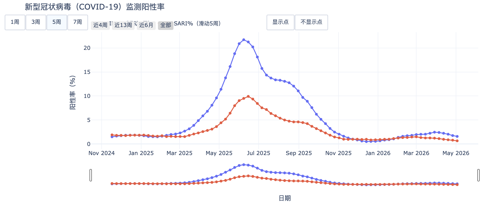

# China CDC Sentinel Hospital Surveillance Data

Automated weekly extraction of respiratory disease surveillance data from China CDC sentinel hospitals — curated for epidemiological research and forecasting.

## Latest Snapshot

<p align="center">
  
  <br/>
  <em>SARS-CoV-2 weekly positivity rate at sentinel hospitals — outpatient ILI (blue) vs. inpatient SARI (red), Nov 2024 – May 2026.</em>
</p>

## Data Pipeline


```mermaid
flowchart LR
    A([China CDC<br/>Website]) -->|crawl links| B[New URL<br/>Discovery]
    B -->|render page| C[PDF<br/>Snapshot]
    C -->|MinerU OCR| D[Markdown<br/>Document]
    D -->|LLM extract| E[Structured<br/>CSV Records]
    E -->|dedup + merge| F[(Main<br/>Datasets)]
    F -->|auto commit| G([GitHub<br/>Release])
```

Orchestrated by Apache Airflow — runs every Friday at 00:00 (Asia/Shanghai) and only commits when new reports are detected.

## Datasets

### `data/cncdc_surveillance_covid19.csv`

Weekly SARS-CoV-2 positivity rates, formatted for the [China-COVID-19-Forecast-Hub](https://github.com/dailypartita/China-COVID-19-Forecast-Hub) project.

| Column            | Type   | Description                                 |
| ----------------- | ------ | ------------------------------------------- |
| `reference_date`  | date   | Surveillance week start (Monday)            |
| `target_end_date` | date   | Surveillance week end (Sunday)              |
| `report_week`     | int    | ISO week number                             |
| `pathogen`        | string | Pathogen name (`新型冠状病毒` / SARS-CoV-2) |
| `ili_percent`     | float  | Outpatient ILI positive rate (%)            |
| `sari_percent`    | float  | Inpatient SARI positive rate (%)            |

### `data/cncdc_surveillance_all.csv`

Full multi-pathogen surveillance panel with the same schema, covering all 11 monitored respiratory pathogens.

### `data/cncdc_suverillance_2025_14_22.csv`

COVID-19-only records reconstructed from monthly China CDC reports for 2025 weeks 14–22, when weekly bulletins were temporarily replaced by monthly summaries.

## Pathogens Monitored

| Chinese name   | English / Scientific name         |
| -------------- | --------------------------------- |
| 新型冠状病毒   | SARS-CoV-2                        |
| 流感病毒       | Influenza virus (A & B)           |
| 呼吸道合胞病毒 | Respiratory Syncytial Virus (RSV) |
| 人偏肺病毒     | Human Metapneumovirus (hMPV)      |
| 副流感病毒     | Parainfluenza virus (PIV)         |
| 普通冠状病毒   | Common human coronaviruses (HCoV) |
| 腺病毒         | Adenovirus                        |
| 博卡病毒       | Bocavirus                         |
| 鼻病毒         | Rhinovirus                        |
| 肠道病毒       | Enterovirus                       |
| 肺炎支原体     | *Mycoplasma pneumoniae*           |

## Repository Layout

```text
cn_cdc_data/
├── data/
│   ├── cncdc_surveillance_covid19.csv      # COVID-19 weekly series
│   ├── cncdc_surveillance_all.csv          # All 11 pathogens
│   └── cncdc_suverillance_2025_14_22.csv   # Historical gap (W14–W22 2025)
└── update/
    └── YYYY-MM-DD/                         # One folder per weekly report
        ├── pdf/                            # Original page snapshot
        ├── md/                             # OCR'd markdown
        └── csv/                            # Extracted weekly records
```

## Quick Start

Load directly from GitHub:

```python
import pandas as pd

URL = "https://raw.githubusercontent.com/dailypartita/cn_cdc_crawl/main/data/cncdc_surveillance_covid19.csv"
df = pd.read_csv(URL)
```

## Notes

- **2025 Weeks 14–22 gap** — China CDC published only monthly aggregated reports during this period. Recovered COVID-19 data is provided separately in `data/cncdc_suverillance_2025_14_22.csv`; other pathogens are not available for these weeks.
- **Reporting basis** — Rates reflect *positivity among sampled patients at sentinel hospitals*, not population incidence.
- **Late revisions** — China CDC occasionally revises prior weeks retroactively; the pipeline deduplicates by `(reference_date, pathogen)` and keeps the most recent value.

## Data Source

Official surveillance bulletins from the Chinese Center for Disease Control and Prevention (China CDC):
<https://www.chinacdc.cn/jksj/jksj04_14275/>

## Contact

Kaixin Yang — `yang_kaixin@gzlab.ac.cn`
Guangzhou Laboratory · Computational Epidemiology Group

## Disclaimer

This dataset is redistributed for non-commercial research and analytical purposes. All original data remains the intellectual property of the Chinese Center for Disease Control and Prevention. Users are responsible for verifying data fitness for their specific use case and for citing the original source.
