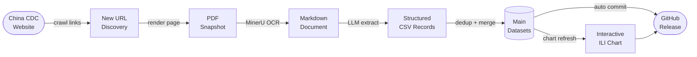

# China CDC Sentinel Hospital Surveillance Data

Automated weekly extraction of respiratory disease surveillance data from China CDC sentinel hospitals — curated for epidemiological research and forecasting.

## Latest Snapshot

<p align="center">
  <em>SARS-CoV-2 weekly ILI positivity rate at sentinel hospitals — <strong>5-week moving average</strong> (CDC sentinel convention). Hover data points for values; expand sections below to change time range.</em>
</p>

<!-- COVID_CHART_START -->
<details open>
<summary><strong>全部</strong> · 悬停数据点查看数值</summary>
<svg xmlns="http://www.w3.org/2000/svg" viewBox="0 0 900 420" width="100%" style="max-width:900px;font-family:Inter,system-ui,sans-serif">
<rect width="100%" height="100%" fill="#fff"/>
<text x="58" y="28" fill="#0f172a" font-size="18" font-weight="700">新型冠状病毒 (COVID-19) 监测阳性率</text>
<text x="58" y="44" fill="#64748b" font-size="12">最新 2026-08-17 · ILI 19.5% · 5周均值 20.5% · 共 194 周</text>
<line x1="58" y1="372.00" x2="882" y2="372.00" stroke="#e2e8f0" stroke-width="1"/>
<text x="50" y="376.00" fill="#64748b" font-size="11" text-anchor="end">0%</text>
<line x1="58" y1="308.00" x2="882" y2="308.00" stroke="#e2e8f0" stroke-width="1"/>
<text x="50" y="312.00" fill="#64748b" font-size="11" text-anchor="end">13%</text>
<line x1="58" y1="244.00" x2="882" y2="244.00" stroke="#e2e8f0" stroke-width="1"/>
<text x="50" y="248.00" fill="#64748b" font-size="11" text-anchor="end">27%</text>
<line x1="58" y1="180.00" x2="882" y2="180.00" stroke="#e2e8f0" stroke-width="1"/>
<text x="50" y="184.00" fill="#64748b" font-size="11" text-anchor="end">40%</text>
<line x1="58" y1="116.00" x2="882" y2="116.00" stroke="#e2e8f0" stroke-width="1"/>
<text x="50" y="120.00" fill="#64748b" font-size="11" text-anchor="end">54%</text>
<line x1="58" y1="52.00" x2="882" y2="52.00" stroke="#e2e8f0" stroke-width="1"/>
<text x="50" y="56.00" fill="#64748b" font-size="11" text-anchor="end">67%</text>
<polyline fill="none" stroke="#93c5fd" stroke-width="1.2" points="58.00,325.81 62.27,213.90 66.54,88.67 70.81,86.29 75.08,157.24 79.35,257.24 83.62,313.43 87.89,335.81 92.16,345.33 96.42,355.81 100.69,352.48 104.96,347.71 109.23,353.90 113.50,359.14 117.77,362.95 122.04,361.05 126.31,359.62 130.58,359.62 134.85,356.76 139.12,351.05 143.39,330.10 147.66,275.81 151.93,217.71 156.20,178.19 160.47,169.62 164.74,188.19 169.01,225.33 173.27,253.90 177.54,276.29 181.81,298.67 186.08,310.10 190.35,310.57 194.62,291.52 198.89,308.19 203.16,303.43 207.43,292.48 211.70,281.52 215.97,278.67 220.24,283.43 224.51,282.95 228.78,289.62 233.05,305.33 237.32,322.00 241.59,330.57 245.85,337.71 250.12,345.33 254.39,352.95 258.66,355.33 262.93,357.71 267.20,362.48 271.47,362.95 275.74,366.29 280.01,366.76 284.28,367.24 288.55,367.71 292.82,367.71 297.09,367.71 301.36,367.24 305.63,362.48 309.90,356.76 314.17,350.57 318.44,344.38 322.70,332.24 326.97,320.10 331.24,300.33 335.51,280.57 339.78,271.52 344.05,275.33 348.32,293.19 352.59,311.05 356.86,323.67 361.13,336.29 365.40,340.10 369.67,343.90 373.94,342.24 378.21,340.57 382.48,343.43 386.75,346.29 391.02,344.38 395.28,342.48 399.55,340.10 403.82,337.71 408.09,329.62 412.36,310.10 416.63,300.57 420.90,282.95 425.17,271.52 429.44,276.76 433.71,277.71 437.98,283.90 442.25,296.29 446.52,311.05 450.79,321.52 455.06,332.00 459.33,342.95 463.60,352.48 467.87,357.71 472.13,361.52 476.40,363.43 480.67,365.33 484.94,364.86 489.21,365.81 493.48,364.86 497.75,364.86 502.02,363.43 506.29,363.43 510.56,363.90 514.83,366.29 519.10,365.81 523.37,366.29 527.64,365.81 531.91,365.33 536.18,363.90 540.45,360.57 544.72,361.52 548.98,361.52 553.25,359.62 557.52,352.95 561.79,349.14 566.06,344.38 570.33,337.71 574.60,336.29 578.87,330.10 583.14,319.14 587.41,308.19 591.68,294.86 595.95,284.86 600.22,275.81 604.49,258.67 608.76,263.43 613.03,274.38 617.30,289.14 621.56,301.52 625.83,308.19 630.10,310.57 634.37,312.48 638.64,308.67 642.91,314.38 647.18,311.52 651.45,316.76 655.72,319.14 659.99,323.43 664.26,333.90 668.53,319.14 672.80,323.43 677.07,333.90 681.34,354.38 685.61,356.76 689.88,361.05 694.15,363.43 698.41,364.86 702.68,365.33 706.95,366.76 711.22,368.19 715.49,369.14 719.76,369.14 724.03,369.62 728.30,369.62 732.57,369.14 736.84,368.67 741.11,368.67 745.38,367.24 749.65,367.24 753.92,364.86 758.19,365.33 762.46,364.38 766.73,364.38 770.99,364.86 775.26,361.05 779.53,362.95 783.80,362.00 788.07,361.05 792.34,362.48 796.61,365.33 800.88,365.81 805.15,368.19 809.42,367.24 813.69,366.76 817.96,365.81 822.23,365.33 826.50,370.10 830.77,362.48 835.04,354.86 839.31,347.71 843.58,340.10 847.84,336.76 852.11,332.95 856.38,318.67 860.65,299.14 864.92,279.14 869.19,271.05 873.46,271.52 877.73,271.05 882.00,279.14" opacity="0.85"/>
<polygon fill="rgba(37, 99, 235, 0.12)" points="58.00,325.81 62.27,269.86 66.54,209.46 70.81,178.67 75.08,174.38 79.35,160.67 83.62,180.57 87.89,230.00 92.16,281.81 96.42,321.52 100.69,340.57 104.96,347.43 109.23,351.05 113.50,353.81 117.77,355.24 122.04,356.95 126.31,359.33 130.58,360.48 134.85,360.00 139.12,357.62 143.39,351.43 147.66,334.67 151.93,306.29 156.20,270.57 160.47,234.29 164.74,205.90 169.01,195.81 173.27,203.05 177.54,222.67 181.81,248.48 186.08,272.86 190.35,289.90 194.62,297.43 198.89,303.81 203.16,304.76 207.43,301.24 211.70,295.43 215.97,292.86 220.24,287.90 224.51,283.81 228.78,283.24 233.05,288.00 237.32,296.67 241.59,306.10 245.85,317.05 250.12,328.19 254.39,337.71 258.66,344.38 262.93,349.81 267.20,354.76 271.47,358.29 275.74,360.95 280.01,363.24 284.28,365.14 288.55,366.19 292.82,367.14 297.09,367.43 301.36,367.52 305.63,366.57 309.90,364.38 314.17,360.95 318.44,356.29 322.70,349.29 326.97,340.81 331.24,329.52 335.51,315.52 339.78,300.95 344.05,289.57 348.32,284.19 352.59,286.33 356.86,294.95 361.13,307.90 365.40,320.86 369.67,331.00 373.94,337.24 378.21,340.62 382.48,342.05 386.75,343.29 391.02,343.38 395.28,343.43 399.55,343.33 403.82,342.19 408.09,338.86 412.36,332.00 416.63,323.62 420.90,312.19 425.17,298.95 429.44,288.38 433.71,281.90 437.98,278.57 442.25,281.24 446.52,289.14 450.79,298.10 455.06,308.95 459.33,320.76 463.60,332.00 467.87,341.33 472.13,349.33 476.40,355.62 480.67,360.10 484.94,362.57 489.21,364.19 493.48,364.86 497.75,365.14 502.02,364.76 506.29,364.48 510.56,364.10 514.83,364.38 519.10,364.57 523.37,365.14 527.64,365.62 531.91,365.90 536.18,365.43 540.45,364.38 544.72,363.43 548.98,362.57 553.25,361.43 557.52,359.24 561.79,356.95 566.06,353.52 570.33,348.76 574.60,344.10 578.87,339.52 583.14,333.52 587.41,326.29 591.68,317.71 595.95,307.43 600.22,296.57 604.49,284.48 608.76,275.52 613.03,271.43 617.30,272.29 621.56,277.43 625.83,287.33 630.10,296.76 634.37,304.38 638.64,308.29 642.91,310.86 647.18,311.52 651.45,312.76 655.72,314.10 659.99,317.05 664.26,320.95 668.53,322.48 672.80,323.81 677.07,326.76 681.34,332.95 685.61,337.52 689.88,345.90 694.15,353.90 698.41,360.10 702.68,362.29 706.95,364.29 711.22,365.71 715.49,366.86 719.76,367.71 724.03,368.57 728.30,369.14 732.57,369.33 736.84,369.24 741.11,369.14 745.38,368.67 749.65,368.19 753.92,367.33 758.19,366.67 762.46,365.81 766.73,365.24 770.99,364.76 775.26,364.00 779.53,363.52 783.80,363.05 788.07,362.38 792.34,361.90 796.61,362.76 800.88,363.33 805.15,364.57 809.42,365.81 813.69,366.67 817.96,366.76 822.23,366.67 826.50,367.05 830.77,366.10 835.04,363.71 839.31,360.10 843.58,355.05 847.84,348.38 852.11,342.48 856.38,335.24 860.65,325.52 864.92,313.33 869.19,300.19 873.46,287.90 877.73,278.38 882.00,274.38 882.00,372.00 58.00,372.00"/>
<polyline fill="none" stroke="#1d4ed8" stroke-width="2.8" points="58.00,325.81 62.27,269.86 66.54,209.46 70.81,178.67 75.08,174.38 79.35,160.67 83.62,180.57 87.89,230.00 92.16,281.81 96.42,321.52 100.69,340.57 104.96,347.43 109.23,351.05 113.50,353.81 117.77,355.24 122.04,356.95 126.31,359.33 130.58,360.48 134.85,360.00 139.12,357.62 143.39,351.43 147.66,334.67 151.93,306.29 156.20,270.57 160.47,234.29 164.74,205.90 169.01,195.81 173.27,203.05 177.54,222.67 181.81,248.48 186.08,272.86 190.35,289.90 194.62,297.43 198.89,303.81 203.16,304.76 207.43,301.24 211.70,295.43 215.97,292.86 220.24,287.90 224.51,283.81 228.78,283.24 233.05,288.00 237.32,296.67 241.59,306.10 245.85,317.05 250.12,328.19 254.39,337.71 258.66,344.38 262.93,349.81 267.20,354.76 271.47,358.29 275.74,360.95 280.01,363.24 284.28,365.14 288.55,366.19 292.82,367.14 297.09,367.43 301.36,367.52 305.63,366.57 309.90,364.38 314.17,360.95 318.44,356.29 322.70,349.29 326.97,340.81 331.24,329.52 335.51,315.52 339.78,300.95 344.05,289.57 348.32,284.19 352.59,286.33 356.86,294.95 361.13,307.90 365.40,320.86 369.67,331.00 373.94,337.24 378.21,340.62 382.48,342.05 386.75,343.29 391.02,343.38 395.28,343.43 399.55,343.33 403.82,342.19 408.09,338.86 412.36,332.00 416.63,323.62 420.90,312.19 425.17,298.95 429.44,288.38 433.71,281.90 437.98,278.57 442.25,281.24 446.52,289.14 450.79,298.10 455.06,308.95 459.33,320.76 463.60,332.00 467.87,341.33 472.13,349.33 476.40,355.62 480.67,360.10 484.94,362.57 489.21,364.19 493.48,364.86 497.75,365.14 502.02,364.76 506.29,364.48 510.56,364.10 514.83,364.38 519.10,364.57 523.37,365.14 527.64,365.62 531.91,365.90 536.18,365.43 540.45,364.38 544.72,363.43 548.98,362.57 553.25,361.43 557.52,359.24 561.79,356.95 566.06,353.52 570.33,348.76 574.60,344.10 578.87,339.52 583.14,333.52 587.41,326.29 591.68,317.71 595.95,307.43 600.22,296.57 604.49,284.48 608.76,275.52 613.03,271.43 617.30,272.29 621.56,277.43 625.83,287.33 630.10,296.76 634.37,304.38 638.64,308.29 642.91,310.86 647.18,311.52 651.45,312.76 655.72,314.10 659.99,317.05 664.26,320.95 668.53,322.48 672.80,323.81 677.07,326.76 681.34,332.95 685.61,337.52 689.88,345.90 694.15,353.90 698.41,360.10 702.68,362.29 706.95,364.29 711.22,365.71 715.49,366.86 719.76,367.71 724.03,368.57 728.30,369.14 732.57,369.33 736.84,369.24 741.11,369.14 745.38,368.67 749.65,368.19 753.92,367.33 758.19,366.67 762.46,365.81 766.73,365.24 770.99,364.76 775.26,364.00 779.53,363.52 783.80,363.05 788.07,362.38 792.34,361.90 796.61,362.76 800.88,363.33 805.15,364.57 809.42,365.81 813.69,366.67 817.96,366.76 822.23,366.67 826.50,367.05 830.77,366.10 835.04,363.71 839.31,360.10 843.58,355.05 847.84,348.38 852.11,342.48 856.38,335.24 860.65,325.52 864.92,313.33 869.19,300.19 873.46,287.90 877.73,278.38 882.00,274.38"/>
<circle cx="58.00" cy="325.81" r="5" fill="#1d4ed8" stroke="#fff" stroke-width="1.5" opacity="0.9"><title>2022-12-05
ILI: 9.7%
5周均值: 9.7%</title></circle>
<circle cx="62.27" cy="269.86" r="5" fill="#1d4ed8" stroke="#fff" stroke-width="1.5" opacity="0.9"><title>2022-12-12
ILI: 33.2%
5周均值: 21.5%</title></circle>
<circle cx="66.54" cy="209.46" r="5" fill="#1d4ed8" stroke="#fff" stroke-width="1.5" opacity="0.9"><title>2022-12-19
ILI: 59.5%
5周均值: 34.1%</title></circle>
<circle cx="70.81" cy="178.67" r="5" fill="#1d4ed8" stroke="#fff" stroke-width="1.5" opacity="0.9"><title>2022-12-26
ILI: 60.0%
5周均值: 40.6%</title></circle>
<circle cx="75.08" cy="174.38" r="5" fill="#1d4ed8" stroke="#fff" stroke-width="1.5" opacity="0.9"><title>2023-01-02
ILI: 45.1%
5周均值: 41.5%</title></circle>
<circle cx="79.35" cy="160.67" r="5" fill="#1d4ed8" stroke="#fff" stroke-width="1.5" opacity="0.9"><title>2023-01-09
ILI: 24.1%
5周均值: 44.4%</title></circle>
<circle cx="83.62" cy="180.57" r="5" fill="#1d4ed8" stroke="#fff" stroke-width="1.5" opacity="0.9"><title>2023-01-16
ILI: 12.3%
5周均值: 40.2%</title></circle>
<circle cx="87.89" cy="230.00" r="5" fill="#1d4ed8" stroke="#fff" stroke-width="1.5" opacity="0.9"><title>2023-01-23
ILI: 7.6%
5周均值: 29.8%</title></circle>
<circle cx="92.16" cy="281.81" r="5" fill="#1d4ed8" stroke="#fff" stroke-width="1.5" opacity="0.9"><title>2023-01-30
ILI: 5.6%
5周均值: 18.9%</title></circle>
<circle cx="96.42" cy="321.52" r="5" fill="#1d4ed8" stroke="#fff" stroke-width="1.5" opacity="0.9"><title>2023-02-06
ILI: 3.4%
5周均值: 10.6%</title></circle>
<circle cx="100.69" cy="340.57" r="5" fill="#1d4ed8" stroke="#fff" stroke-width="1.5" opacity="0.9"><title>2023-02-13
ILI: 4.1%
5周均值: 6.6%</title></circle>
<circle cx="104.96" cy="347.43" r="5" fill="#1d4ed8" stroke="#fff" stroke-width="1.5" opacity="0.9"><title>2023-02-20
ILI: 5.1%
5周均值: 5.2%</title></circle>
<circle cx="109.23" cy="351.05" r="5" fill="#1d4ed8" stroke="#fff" stroke-width="1.5" opacity="0.9"><title>2023-02-27
ILI: 3.8%
5周均值: 4.4%</title></circle>
<circle cx="113.50" cy="353.81" r="5" fill="#1d4ed8" stroke="#fff" stroke-width="1.5" opacity="0.9"><title>2023-03-06
ILI: 2.7%
5周均值: 3.8%</title></circle>
<circle cx="117.77" cy="355.24" r="5" fill="#1d4ed8" stroke="#fff" stroke-width="1.5" opacity="0.9"><title>2023-03-13
ILI: 1.9%
5周均值: 3.5%</title></circle>
<circle cx="122.04" cy="356.95" r="5" fill="#1d4ed8" stroke="#fff" stroke-width="1.5" opacity="0.9"><title>2023-03-20
ILI: 2.3%
5周均值: 3.2%</title></circle>
<circle cx="126.31" cy="359.33" r="5" fill="#1d4ed8" stroke="#fff" stroke-width="1.5" opacity="0.9"><title>2023-03-27
ILI: 2.6%
5周均值: 2.7%</title></circle>
<circle cx="130.58" cy="360.48" r="5" fill="#1d4ed8" stroke="#fff" stroke-width="1.5" opacity="0.9"><title>2023-04-03
ILI: 2.6%
5周均值: 2.4%</title></circle>
<circle cx="134.85" cy="360.00" r="5" fill="#1d4ed8" stroke="#fff" stroke-width="1.5" opacity="0.9"><title>2023-04-10
ILI: 3.2%
5周均值: 2.5%</title></circle>
<circle cx="139.12" cy="357.62" r="5" fill="#1d4ed8" stroke="#fff" stroke-width="1.5" opacity="0.9"><title>2023-04-17
ILI: 4.4%
5周均值: 3.0%</title></circle>
<circle cx="143.39" cy="351.43" r="5" fill="#1d4ed8" stroke="#fff" stroke-width="1.5" opacity="0.9"><title>2023-04-24
ILI: 8.8%
5周均值: 4.3%</title></circle>
<circle cx="147.66" cy="334.67" r="5" fill="#1d4ed8" stroke="#fff" stroke-width="1.5" opacity="0.9"><title>2023-05-01
ILI: 20.2%
5周均值: 7.8%</title></circle>
<circle cx="151.93" cy="306.29" r="5" fill="#1d4ed8" stroke="#fff" stroke-width="1.5" opacity="0.9"><title>2023-05-08
ILI: 32.4%
5周均值: 13.8%</title></circle>
<circle cx="156.20" cy="270.57" r="5" fill="#1d4ed8" stroke="#fff" stroke-width="1.5" opacity="0.9"><title>2023-05-15
ILI: 40.7%
5周均值: 21.3%</title></circle>
<circle cx="160.47" cy="234.29" r="5" fill="#1d4ed8" stroke="#fff" stroke-width="1.5" opacity="0.9"><title>2023-05-22
ILI: 42.5%
5周均值: 28.9%</title></circle>
<circle cx="164.74" cy="205.90" r="5" fill="#1d4ed8" stroke="#fff" stroke-width="1.5" opacity="0.9"><title>2023-05-29
ILI: 38.6%
5周均值: 34.9%</title></circle>
<circle cx="169.01" cy="195.81" r="5" fill="#1d4ed8" stroke="#fff" stroke-width="1.5" opacity="0.9"><title>2023-06-05
ILI: 30.8%
5周均值: 37.0%</title></circle>
<circle cx="173.27" cy="203.05" r="5" fill="#1d4ed8" stroke="#fff" stroke-width="1.5" opacity="0.9"><title>2023-06-12
ILI: 24.8%
5周均值: 35.5%</title></circle>
<circle cx="177.54" cy="222.67" r="5" fill="#1d4ed8" stroke="#fff" stroke-width="1.5" opacity="0.9"><title>2023-06-19
ILI: 20.1%
5周均值: 31.4%</title></circle>
<circle cx="181.81" cy="248.48" r="5" fill="#1d4ed8" stroke="#fff" stroke-width="1.5" opacity="0.9"><title>2023-06-26
ILI: 15.4%
5周均值: 25.9%</title></circle>
<circle cx="186.08" cy="272.86" r="5" fill="#1d4ed8" stroke="#fff" stroke-width="1.5" opacity="0.9"><title>2023-07-03
ILI: 13.0%
5周均值: 20.8%</title></circle>
<circle cx="190.35" cy="289.90" r="5" fill="#1d4ed8" stroke="#fff" stroke-width="1.5" opacity="0.9"><title>2023-07-10
ILI: 12.9%
5周均值: 17.2%</title></circle>
<circle cx="194.62" cy="297.43" r="5" fill="#1d4ed8" stroke="#fff" stroke-width="1.5" opacity="0.9"><title>2023-07-17
ILI: 16.9%
5周均值: 15.7%</title></circle>
<circle cx="198.89" cy="303.81" r="5" fill="#1d4ed8" stroke="#fff" stroke-width="1.5" opacity="0.9"><title>2023-07-24
ILI: 13.4%
5周均值: 14.3%</title></circle>
<circle cx="203.16" cy="304.76" r="5" fill="#1d4ed8" stroke="#fff" stroke-width="1.5" opacity="0.9"><title>2023-07-31
ILI: 14.4%
5周均值: 14.1%</title></circle>
<circle cx="207.43" cy="301.24" r="5" fill="#1d4ed8" stroke="#fff" stroke-width="1.5" opacity="0.9"><title>2023-08-07
ILI: 16.7%
5周均值: 14.9%</title></circle>
<circle cx="211.70" cy="295.43" r="5" fill="#1d4ed8" stroke="#fff" stroke-width="1.5" opacity="0.9"><title>2023-08-14
ILI: 19.0%
5周均值: 16.1%</title></circle>
<circle cx="215.97" cy="292.86" r="5" fill="#1d4ed8" stroke="#fff" stroke-width="1.5" opacity="0.9"><title>2023-08-21
ILI: 19.6%
5周均值: 16.6%</title></circle>
<circle cx="220.24" cy="287.90" r="5" fill="#1d4ed8" stroke="#fff" stroke-width="1.5" opacity="0.9"><title>2023-08-28
ILI: 18.6%
5周均值: 17.7%</title></circle>
<circle cx="224.51" cy="283.81" r="5" fill="#1d4ed8" stroke="#fff" stroke-width="1.5" opacity="0.9"><title>2023-09-04
ILI: 18.7%
5周均值: 18.5%</title></circle>
<circle cx="228.78" cy="283.24" r="5" fill="#1d4ed8" stroke="#fff" stroke-width="1.5" opacity="0.9"><title>2023-09-11
ILI: 17.3%
5周均值: 18.6%</title></circle>
<circle cx="233.05" cy="288.00" r="5" fill="#1d4ed8" stroke="#fff" stroke-width="1.5" opacity="0.9"><title>2023-09-18
ILI: 14.0%
5周均值: 17.6%</title></circle>
<circle cx="237.32" cy="296.67" r="5" fill="#1d4ed8" stroke="#fff" stroke-width="1.5" opacity="0.9"><title>2023-09-25
ILI: 10.5%
5周均值: 15.8%</title></circle>
<circle cx="241.59" cy="306.10" r="5" fill="#1d4ed8" stroke="#fff" stroke-width="1.5" opacity="0.9"><title>2023-10-02
ILI: 8.7%
5周均值: 13.8%</title></circle>
<circle cx="245.85" cy="317.05" r="5" fill="#1d4ed8" stroke="#fff" stroke-width="1.5" opacity="0.9"><title>2023-10-09
ILI: 7.2%
5周均值: 11.5%</title></circle>
<circle cx="250.12" cy="328.19" r="5" fill="#1d4ed8" stroke="#fff" stroke-width="1.5" opacity="0.9"><title>2023-10-16
ILI: 5.6%
5周均值: 9.2%</title></circle>
<circle cx="254.39" cy="337.71" r="5" fill="#1d4ed8" stroke="#fff" stroke-width="1.5" opacity="0.9"><title>2023-10-23
ILI: 4.0%
5周均值: 7.2%</title></circle>
<circle cx="258.66" cy="344.38" r="5" fill="#1d4ed8" stroke="#fff" stroke-width="1.5" opacity="0.9"><title>2023-10-30
ILI: 3.5%
5周均值: 5.8%</title></circle>
<circle cx="262.93" cy="349.81" r="5" fill="#1d4ed8" stroke="#fff" stroke-width="1.5" opacity="0.9"><title>2023-11-06
ILI: 3.0%
5周均值: 4.7%</title></circle>
<circle cx="267.20" cy="354.76" r="5" fill="#1d4ed8" stroke="#fff" stroke-width="1.5" opacity="0.9"><title>2023-11-13
ILI: 2.0%
5周均值: 3.6%</title></circle>
<circle cx="271.47" cy="358.29" r="5" fill="#1d4ed8" stroke="#fff" stroke-width="1.5" opacity="0.9"><title>2023-11-20
ILI: 1.9%
5周均值: 2.9%</title></circle>
<circle cx="275.74" cy="360.95" r="5" fill="#1d4ed8" stroke="#fff" stroke-width="1.5" opacity="0.9"><title>2023-11-27
ILI: 1.2%
5周均值: 2.3%</title></circle>
<circle cx="280.01" cy="363.24" r="5" fill="#1d4ed8" stroke="#fff" stroke-width="1.5" opacity="0.9"><title>2023-12-04
ILI: 1.1%
5周均值: 1.8%</title></circle>
<circle cx="284.28" cy="365.14" r="5" fill="#1d4ed8" stroke="#fff" stroke-width="1.5" opacity="0.9"><title>2023-12-11
ILI: 1.0%
5周均值: 1.4%</title></circle>
<circle cx="288.55" cy="366.19" r="5" fill="#1d4ed8" stroke="#fff" stroke-width="1.5" opacity="0.9"><title>2023-12-18
ILI: 0.9%
5周均值: 1.2%</title></circle>
<circle cx="292.82" cy="367.14" r="5" fill="#1d4ed8" stroke="#fff" stroke-width="1.5" opacity="0.9"><title>2023-12-25
ILI: 0.9%
5周均值: 1.0%</title></circle>
<circle cx="297.09" cy="367.43" r="5" fill="#1d4ed8" stroke="#fff" stroke-width="1.5" opacity="0.9"><title>2024-01-01
ILI: 0.9%
5周均值: 1.0%</title></circle>
<circle cx="301.36" cy="367.52" r="5" fill="#1d4ed8" stroke="#fff" stroke-width="1.5" opacity="0.9"><title>2024-01-08
ILI: 1.0%
5周均值: 0.9%</title></circle>
<circle cx="305.63" cy="366.57" r="5" fill="#1d4ed8" stroke="#fff" stroke-width="1.5" opacity="0.9"><title>2024-01-15
ILI: 2.0%
5周均值: 1.1%</title></circle>
<circle cx="309.90" cy="364.38" r="5" fill="#1d4ed8" stroke="#fff" stroke-width="1.5" opacity="0.9"><title>2024-01-22
ILI: 3.2%
5周均值: 1.6%</title></circle>
<circle cx="314.17" cy="360.95" r="5" fill="#1d4ed8" stroke="#fff" stroke-width="1.5" opacity="0.9"><title>2024-01-29
ILI: 4.5%
5周均值: 2.3%</title></circle>
<circle cx="318.44" cy="356.29" r="5" fill="#1d4ed8" stroke="#fff" stroke-width="1.5" opacity="0.9"><title>2024-02-05
ILI: 5.8%
5周均值: 3.3%</title></circle>
<circle cx="322.70" cy="349.29" r="5" fill="#1d4ed8" stroke="#fff" stroke-width="1.5" opacity="0.9"><title>2024-02-12
ILI: 8.3%
5周均值: 4.8%</title></circle>
<circle cx="326.97" cy="340.81" r="5" fill="#1d4ed8" stroke="#fff" stroke-width="1.5" opacity="0.9"><title>2024-02-19
ILI: 10.9%
5周均值: 6.5%</title></circle>
<circle cx="331.24" cy="329.52" r="5" fill="#1d4ed8" stroke="#fff" stroke-width="1.5" opacity="0.9"><title>2024-02-26
ILI: 15.1%
5周均值: 8.9%</title></circle>
<circle cx="335.51" cy="315.52" r="5" fill="#1d4ed8" stroke="#fff" stroke-width="1.5" opacity="0.9"><title>2024-03-04
ILI: 19.2%
5周均值: 11.9%</title></circle>
<circle cx="339.78" cy="300.95" r="5" fill="#1d4ed8" stroke="#fff" stroke-width="1.5" opacity="0.9"><title>2024-03-11
ILI: 21.1%
5周均值: 14.9%</title></circle>
<circle cx="344.05" cy="289.57" r="5" fill="#1d4ed8" stroke="#fff" stroke-width="1.5" opacity="0.9"><title>2024-03-18
ILI: 20.3%
5周均值: 17.3%</title></circle>
<circle cx="348.32" cy="284.19" r="5" fill="#1d4ed8" stroke="#fff" stroke-width="1.5" opacity="0.9"><title>2024-03-25
ILI: 16.6%
5周均值: 18.4%</title></circle>
<circle cx="352.59" cy="286.33" r="5" fill="#1d4ed8" stroke="#fff" stroke-width="1.5" opacity="0.9"><title>2024-04-01
ILI: 12.8%
5周均值: 18.0%</title></circle>
<circle cx="356.86" cy="294.95" r="5" fill="#1d4ed8" stroke="#fff" stroke-width="1.5" opacity="0.9"><title>2024-04-08
ILI: 10.2%
5周均值: 16.2%</title></circle>
<circle cx="361.13" cy="307.90" r="5" fill="#1d4ed8" stroke="#fff" stroke-width="1.5" opacity="0.9"><title>2024-04-15
ILI: 7.5%
5周均值: 13.5%</title></circle>
<circle cx="365.40" cy="320.86" r="5" fill="#1d4ed8" stroke="#fff" stroke-width="1.5" opacity="0.9"><title>2024-04-22
ILI: 6.7%
5周均值: 10.7%</title></circle>
<circle cx="369.67" cy="331.00" r="5" fill="#1d4ed8" stroke="#fff" stroke-width="1.5" opacity="0.9"><title>2024-04-29
ILI: 5.9%
5周均值: 8.6%</title></circle>
<circle cx="373.94" cy="337.24" r="5" fill="#1d4ed8" stroke="#fff" stroke-width="1.5" opacity="0.9"><title>2024-05-06
ILI: 6.2%
5周均值: 7.3%</title></circle>
<circle cx="378.21" cy="340.62" r="5" fill="#1d4ed8" stroke="#fff" stroke-width="1.5" opacity="0.9"><title>2024-05-13
ILI: 6.6%
5周均值: 6.6%</title></circle>
<circle cx="382.48" cy="342.05" r="5" fill="#1d4ed8" stroke="#fff" stroke-width="1.5" opacity="0.9"><title>2024-05-20
ILI: 6.0%
5周均值: 6.3%</title></circle>
<circle cx="386.75" cy="343.29" r="5" fill="#1d4ed8" stroke="#fff" stroke-width="1.5" opacity="0.9"><title>2024-05-27
ILI: 5.4%
5周均值: 6.0%</title></circle>
<circle cx="391.02" cy="343.38" r="5" fill="#1d4ed8" stroke="#fff" stroke-width="1.5" opacity="0.9"><title>2024-06-03
ILI: 5.8%
5周均值: 6.0%</title></circle>
<circle cx="395.28" cy="343.43" r="5" fill="#1d4ed8" stroke="#fff" stroke-width="1.5" opacity="0.9"><title>2024-06-10
ILI: 6.2%
5周均值: 6.0%</title></circle>
<circle cx="399.55" cy="343.33" r="5" fill="#1d4ed8" stroke="#fff" stroke-width="1.5" opacity="0.9"><title>2024-06-17
ILI: 6.7%
5周均值: 6.0%</title></circle>
<circle cx="403.82" cy="342.19" r="5" fill="#1d4ed8" stroke="#fff" stroke-width="1.5" opacity="0.9"><title>2024-06-24
ILI: 7.2%
5周均值: 6.3%</title></circle>
<circle cx="408.09" cy="338.86" r="5" fill="#1d4ed8" stroke="#fff" stroke-width="1.5" opacity="0.9"><title>2024-07-01
ILI: 8.9%
5周均值: 7.0%</title></circle>
<circle cx="412.36" cy="332.00" r="5" fill="#1d4ed8" stroke="#fff" stroke-width="1.5" opacity="0.9"><title>2024-07-08
ILI: 13.0%
5周均值: 8.4%</title></circle>
<circle cx="416.63" cy="323.62" r="5" fill="#1d4ed8" stroke="#fff" stroke-width="1.5" opacity="0.9"><title>2024-07-15
ILI: 15.0%
5周均值: 10.2%</title></circle>
<circle cx="420.90" cy="312.19" r="5" fill="#1d4ed8" stroke="#fff" stroke-width="1.5" opacity="0.9"><title>2024-07-22
ILI: 18.7%
5周均值: 12.6%</title></circle>
<circle cx="425.17" cy="298.95" r="5" fill="#1d4ed8" stroke="#fff" stroke-width="1.5" opacity="0.9"><title>2024-07-29
ILI: 21.1%
5周均值: 15.3%</title></circle>
<circle cx="429.44" cy="288.38" r="5" fill="#1d4ed8" stroke="#fff" stroke-width="1.5" opacity="0.9"><title>2024-08-05
ILI: 20.0%
5周均值: 17.6%</title></circle>
<circle cx="433.71" cy="281.90" r="5" fill="#1d4ed8" stroke="#fff" stroke-width="1.5" opacity="0.9"><title>2024-08-12
ILI: 19.8%
5周均值: 18.9%</title></circle>
<circle cx="437.98" cy="278.57" r="5" fill="#1d4ed8" stroke="#fff" stroke-width="1.5" opacity="0.9"><title>2024-08-19
ILI: 18.5%
5周均值: 19.6%</title></circle>
<circle cx="442.25" cy="281.24" r="5" fill="#1d4ed8" stroke="#fff" stroke-width="1.5" opacity="0.9"><title>2024-08-26
ILI: 15.9%
5周均值: 19.1%</title></circle>
<circle cx="446.52" cy="289.14" r="5" fill="#1d4ed8" stroke="#fff" stroke-width="1.5" opacity="0.9"><title>2024-09-02
ILI: 12.8%
5周均值: 17.4%</title></circle>
<circle cx="450.79" cy="298.10" r="5" fill="#1d4ed8" stroke="#fff" stroke-width="1.5" opacity="0.9"><title>2024-09-09
ILI: 10.6%
5周均值: 15.5%</title></circle>
<circle cx="455.06" cy="308.95" r="5" fill="#1d4ed8" stroke="#fff" stroke-width="1.5" opacity="0.9"><title>2024-09-16
ILI: 8.4%
5周均值: 13.2%</title></circle>
<circle cx="459.33" cy="320.76" r="5" fill="#1d4ed8" stroke="#fff" stroke-width="1.5" opacity="0.9"><title>2024-09-23
ILI: 6.1%
5周均值: 10.8%</title></circle>
<circle cx="463.60" cy="332.00" r="5" fill="#1d4ed8" stroke="#fff" stroke-width="1.5" opacity="0.9"><title>2024-09-30
ILI: 4.1%
5周均值: 8.4%</title></circle>
<circle cx="467.87" cy="341.33" r="5" fill="#1d4ed8" stroke="#fff" stroke-width="1.5" opacity="0.9"><title>2024-10-07
ILI: 3.0%
5周均值: 6.4%</title></circle>
<circle cx="472.13" cy="349.33" r="5" fill="#1d4ed8" stroke="#fff" stroke-width="1.5" opacity="0.9"><title>2024-10-14
ILI: 2.2%
5周均值: 4.8%</title></circle>
<circle cx="476.40" cy="355.62" r="5" fill="#1d4ed8" stroke="#fff" stroke-width="1.5" opacity="0.9"><title>2024-10-21
ILI: 1.8%
5周均值: 3.4%</title></circle>
<circle cx="480.67" cy="360.10" r="5" fill="#1d4ed8" stroke="#fff" stroke-width="1.5" opacity="0.9"><title>2024-10-28
ILI: 1.4%
5周均值: 2.5%</title></circle>
<circle cx="484.94" cy="362.57" r="5" fill="#1d4ed8" stroke="#fff" stroke-width="1.5" opacity="0.9"><title>2024-11-04
ILI: 1.5%
5周均值: 2.0%</title></circle>
<circle cx="489.21" cy="364.19" r="5" fill="#1d4ed8" stroke="#fff" stroke-width="1.5" opacity="0.9"><title>2024-11-11
ILI: 1.3%
5周均值: 1.6%</title></circle>
<circle cx="493.48" cy="364.86" r="5" fill="#1d4ed8" stroke="#fff" stroke-width="1.5" opacity="0.9"><title>2024-11-18
ILI: 1.5%
5周均值: 1.5%</title></circle>
<circle cx="497.75" cy="365.14" r="5" fill="#1d4ed8" stroke="#fff" stroke-width="1.5" opacity="0.9"><title>2024-11-25
ILI: 1.5%
5周均值: 1.4%</title></circle>
<circle cx="502.02" cy="364.76" r="5" fill="#1d4ed8" stroke="#fff" stroke-width="1.5" opacity="0.9"><title>2024-12-02
ILI: 1.8%
5周均值: 1.5%</title></circle>
<circle cx="506.29" cy="364.48" r="5" fill="#1d4ed8" stroke="#fff" stroke-width="1.5" opacity="0.9"><title>2024-12-09
ILI: 1.8%
5周均值: 1.6%</title></circle>
<circle cx="510.56" cy="364.10" r="5" fill="#1d4ed8" stroke="#fff" stroke-width="1.5" opacity="0.9"><title>2024-12-16
ILI: 1.7%
5周均值: 1.7%</title></circle>
<circle cx="514.83" cy="364.38" r="5" fill="#1d4ed8" stroke="#fff" stroke-width="1.5" opacity="0.9"><title>2024-12-23
ILI: 1.2%
5周均值: 1.6%</title></circle>
<circle cx="519.10" cy="364.57" r="5" fill="#1d4ed8" stroke="#fff" stroke-width="1.5" opacity="0.9"><title>2024-12-30
ILI: 1.3%
5周均值: 1.6%</title></circle>
<circle cx="523.37" cy="365.14" r="5" fill="#1d4ed8" stroke="#fff" stroke-width="1.5" opacity="0.9"><title>2025-01-06
ILI: 1.2%
5周均值: 1.4%</title></circle>
<circle cx="527.64" cy="365.62" r="5" fill="#1d4ed8" stroke="#fff" stroke-width="1.5" opacity="0.9"><title>2025-01-13
ILI: 1.3%
5周均值: 1.3%</title></circle>
<circle cx="531.91" cy="365.90" r="5" fill="#1d4ed8" stroke="#fff" stroke-width="1.5" opacity="0.9"><title>2025-01-20
ILI: 1.4%
5周均值: 1.3%</title></circle>
<circle cx="536.18" cy="365.43" r="5" fill="#1d4ed8" stroke="#fff" stroke-width="1.5" opacity="0.9"><title>2025-01-27
ILI: 1.7%
5周均值: 1.4%</title></circle>
<circle cx="540.45" cy="364.38" r="5" fill="#1d4ed8" stroke="#fff" stroke-width="1.5" opacity="0.9"><title>2025-02-03
ILI: 2.4%
5周均值: 1.6%</title></circle>
<circle cx="544.72" cy="363.43" r="5" fill="#1d4ed8" stroke="#fff" stroke-width="1.5" opacity="0.9"><title>2025-02-10
ILI: 2.2%
5周均值: 1.8%</title></circle>
<circle cx="548.98" cy="362.57" r="5" fill="#1d4ed8" stroke="#fff" stroke-width="1.5" opacity="0.9"><title>2025-02-17
ILI: 2.2%
5周均值: 2.0%</title></circle>
<circle cx="553.25" cy="361.43" r="5" fill="#1d4ed8" stroke="#fff" stroke-width="1.5" opacity="0.9"><title>2025-02-24
ILI: 2.6%
5周均值: 2.2%</title></circle>
<circle cx="557.52" cy="359.24" r="5" fill="#1d4ed8" stroke="#fff" stroke-width="1.5" opacity="0.9"><title>2025-03-03
ILI: 4.0%
5周均值: 2.7%</title></circle>
<circle cx="561.79" cy="356.95" r="5" fill="#1d4ed8" stroke="#fff" stroke-width="1.5" opacity="0.9"><title>2025-03-10
ILI: 4.8%
5周均值: 3.2%</title></circle>
<circle cx="566.06" cy="353.52" r="5" fill="#1d4ed8" stroke="#fff" stroke-width="1.5" opacity="0.9"><title>2025-03-17
ILI: 5.8%
5周均值: 3.9%</title></circle>
<circle cx="570.33" cy="348.76" r="5" fill="#1d4ed8" stroke="#fff" stroke-width="1.5" opacity="0.9"><title>2025-03-24
ILI: 7.2%
5周均值: 4.9%</title></circle>
<circle cx="574.60" cy="344.10" r="5" fill="#1d4ed8" stroke="#fff" stroke-width="1.5" opacity="0.9"><title>2025-03-31
ILI: 7.5%
5周均值: 5.9%</title></circle>
<circle cx="578.87" cy="339.52" r="5" fill="#1d4ed8" stroke="#fff" stroke-width="1.5" opacity="0.9"><title>2025-04-07
ILI: 8.8%
5周均值: 6.8%</title></circle>
<circle cx="583.14" cy="333.52" r="5" fill="#1d4ed8" stroke="#fff" stroke-width="1.5" opacity="0.9"><title>2025-04-14
ILI: 11.1%
5周均值: 8.1%</title></circle>
<circle cx="587.41" cy="326.29" r="5" fill="#1d4ed8" stroke="#fff" stroke-width="1.5" opacity="0.9"><title>2025-04-21
ILI: 13.4%
5周均值: 9.6%</title></circle>
<circle cx="591.68" cy="317.71" r="5" fill="#1d4ed8" stroke="#fff" stroke-width="1.5" opacity="0.9"><title>2025-04-28
ILI: 16.2%
5周均值: 11.4%</title></circle>
<circle cx="595.95" cy="307.43" r="5" fill="#1d4ed8" stroke="#fff" stroke-width="1.5" opacity="0.9"><title>2025-05-05
ILI: 18.3%
5周均值: 13.6%</title></circle>
<circle cx="600.22" cy="296.57" r="5" fill="#1d4ed8" stroke="#fff" stroke-width="1.5" opacity="0.9"><title>2025-05-12
ILI: 20.2%
5周均值: 15.8%</title></circle>
<circle cx="604.49" cy="284.48" r="5" fill="#1d4ed8" stroke="#fff" stroke-width="1.5" opacity="0.9"><title>2025-05-19
ILI: 23.8%
5周均值: 18.4%</title></circle>
<circle cx="608.76" cy="275.52" r="5" fill="#1d4ed8" stroke="#fff" stroke-width="1.5" opacity="0.9"><title>2025-05-26
ILI: 22.8%
5周均值: 20.3%</title></circle>
<circle cx="613.03" cy="271.43" r="5" fill="#1d4ed8" stroke="#fff" stroke-width="1.5" opacity="0.9"><title>2025-06-02
ILI: 20.5%
5周均值: 21.1%</title></circle>
<circle cx="617.30" cy="272.29" r="5" fill="#1d4ed8" stroke="#fff" stroke-width="1.5" opacity="0.9"><title>2025-06-09
ILI: 17.4%
5周均值: 20.9%</title></circle>
<circle cx="621.56" cy="277.43" r="5" fill="#1d4ed8" stroke="#fff" stroke-width="1.5" opacity="0.9"><title>2025-06-16
ILI: 14.8%
5周均值: 19.9%</title></circle>
<circle cx="625.83" cy="287.33" r="5" fill="#1d4ed8" stroke="#fff" stroke-width="1.5" opacity="0.9"><title>2025-06-23
ILI: 13.4%
5周均值: 17.8%</title></circle>
<circle cx="630.10" cy="296.76" r="5" fill="#1d4ed8" stroke="#fff" stroke-width="1.5" opacity="0.9"><title>2025-06-30
ILI: 12.9%
5周均值: 15.8%</title></circle>
<circle cx="634.37" cy="304.38" r="5" fill="#1d4ed8" stroke="#fff" stroke-width="1.5" opacity="0.9"><title>2025-07-07
ILI: 12.5%
5周均值: 14.2%</title></circle>
<circle cx="638.64" cy="308.29" r="5" fill="#1d4ed8" stroke="#fff" stroke-width="1.5" opacity="0.9"><title>2025-07-14
ILI: 13.3%
5周均值: 13.4%</title></circle>
<circle cx="642.91" cy="310.86" r="5" fill="#1d4ed8" stroke="#fff" stroke-width="1.5" opacity="0.9"><title>2025-07-21
ILI: 12.1%
5周均值: 12.8%</title></circle>
<circle cx="647.18" cy="311.52" r="5" fill="#1d4ed8" stroke="#fff" stroke-width="1.5" opacity="0.9"><title>2025-07-28
ILI: 12.7%
5周均值: 12.7%</title></circle>
<circle cx="651.45" cy="312.76" r="5" fill="#1d4ed8" stroke="#fff" stroke-width="1.5" opacity="0.9"><title>2025-08-04
ILI: 11.6%
5周均值: 12.4%</title></circle>
<circle cx="655.72" cy="314.10" r="5" fill="#1d4ed8" stroke="#fff" stroke-width="1.5" opacity="0.9"><title>2025-08-11
ILI: 11.1%
5周均值: 12.2%</title></circle>
<circle cx="659.99" cy="317.05" r="5" fill="#1d4ed8" stroke="#fff" stroke-width="1.5" opacity="0.9"><title>2025-08-18
ILI: 10.2%
5周均值: 11.5%</title></circle>
<circle cx="664.26" cy="320.95" r="5" fill="#1d4ed8" stroke="#fff" stroke-width="1.5" opacity="0.9"><title>2025-08-25
ILI: 8.0%
5周均值: 10.7%</title></circle>
<circle cx="668.53" cy="322.48" r="5" fill="#1d4ed8" stroke="#fff" stroke-width="1.5" opacity="0.9"><title>2025-09-01
ILI: 11.1%
5周均值: 10.4%</title></circle>
<circle cx="672.80" cy="323.81" r="5" fill="#1d4ed8" stroke="#fff" stroke-width="1.5" opacity="0.9"><title>2025-09-08
ILI: 10.2%
5周均值: 10.1%</title></circle>
<circle cx="677.07" cy="326.76" r="5" fill="#1d4ed8" stroke="#fff" stroke-width="1.5" opacity="0.9"><title>2025-09-15
ILI: 8.0%
5周均值: 9.5%</title></circle>
<circle cx="681.34" cy="332.95" r="5" fill="#1d4ed8" stroke="#fff" stroke-width="1.5" opacity="0.9"><title>2025-09-22
ILI: 3.7%
5周均值: 8.2%</title></circle>
<circle cx="685.61" cy="337.52" r="5" fill="#1d4ed8" stroke="#fff" stroke-width="1.5" opacity="0.9"><title>2025-09-29
ILI: 3.2%
5周均值: 7.2%</title></circle>
<circle cx="689.88" cy="345.90" r="5" fill="#1d4ed8" stroke="#fff" stroke-width="1.5" opacity="0.9"><title>2025-10-06
ILI: 2.3%
5周均值: 5.5%</title></circle>
<circle cx="694.15" cy="353.90" r="5" fill="#1d4ed8" stroke="#fff" stroke-width="1.5" opacity="0.9"><title>2025-10-13
ILI: 1.8%
5周均值: 3.8%</title></circle>
<circle cx="698.41" cy="360.10" r="5" fill="#1d4ed8" stroke="#fff" stroke-width="1.5" opacity="0.9"><title>2025-10-20
ILI: 1.5%
5周均值: 2.5%</title></circle>
<circle cx="702.68" cy="362.29" r="5" fill="#1d4ed8" stroke="#fff" stroke-width="1.5" opacity="0.9"><title>2025-10-27
ILI: 1.4%
5周均值: 2.0%</title></circle>
<circle cx="706.95" cy="364.29" r="5" fill="#1d4ed8" stroke="#fff" stroke-width="1.5" opacity="0.9"><title>2025-11-03
ILI: 1.1%
5周均值: 1.6%</title></circle>
<circle cx="711.22" cy="365.71" r="5" fill="#1d4ed8" stroke="#fff" stroke-width="1.5" opacity="0.9"><title>2025-11-10
ILI: 0.8%
5周均值: 1.3%</title></circle>
<circle cx="715.49" cy="366.86" r="5" fill="#1d4ed8" stroke="#fff" stroke-width="1.5" opacity="0.9"><title>2025-11-17
ILI: 0.6%
5周均值: 1.1%</title></circle>
<circle cx="719.76" cy="367.71" r="5" fill="#1d4ed8" stroke="#fff" stroke-width="1.5" opacity="0.9"><title>2025-11-24
ILI: 0.6%
5周均值: 0.9%</title></circle>
<circle cx="724.03" cy="368.57" r="5" fill="#1d4ed8" stroke="#fff" stroke-width="1.5" opacity="0.9"><title>2025-12-01
ILI: 0.5%
5周均值: 0.7%</title></circle>
<circle cx="728.30" cy="369.14" r="5" fill="#1d4ed8" stroke="#fff" stroke-width="1.5" opacity="0.9"><title>2025-12-08
ILI: 0.5%
5周均值: 0.6%</title></circle>
<circle cx="732.57" cy="369.33" r="5" fill="#1d4ed8" stroke="#fff" stroke-width="1.5" opacity="0.9"><title>2025-12-15
ILI: 0.6%
5周均值: 0.6%</title></circle>
<circle cx="736.84" cy="369.24" r="5" fill="#1d4ed8" stroke="#fff" stroke-width="1.5" opacity="0.9"><title>2025-12-22
ILI: 0.7%
5周均值: 0.6%</title></circle>
<circle cx="741.11" cy="369.14" r="5" fill="#1d4ed8" stroke="#fff" stroke-width="1.5" opacity="0.9"><title>2025-12-29
ILI: 0.7%
5周均值: 0.6%</title></circle>
<circle cx="745.38" cy="368.67" r="5" fill="#1d4ed8" stroke="#fff" stroke-width="1.5" opacity="0.9"><title>2026-01-05
ILI: 1.0%
5周均值: 0.7%</title></circle>
<circle cx="749.65" cy="368.19" r="5" fill="#1d4ed8" stroke="#fff" stroke-width="1.5" opacity="0.9"><title>2026-01-12
ILI: 1.0%
5周均值: 0.8%</title></circle>
<circle cx="753.92" cy="367.33" r="5" fill="#1d4ed8" stroke="#fff" stroke-width="1.5" opacity="0.9"><title>2026-01-19
ILI: 1.5%
5周均值: 1.0%</title></circle>
<circle cx="758.19" cy="366.67" r="5" fill="#1d4ed8" stroke="#fff" stroke-width="1.5" opacity="0.9"><title>2026-01-26
ILI: 1.4%
5周均值: 1.1%</title></circle>
<circle cx="762.46" cy="365.81" r="5" fill="#1d4ed8" stroke="#fff" stroke-width="1.5" opacity="0.9"><title>2026-02-02
ILI: 1.6%
5周均值: 1.3%</title></circle>
<circle cx="766.73" cy="365.24" r="5" fill="#1d4ed8" stroke="#fff" stroke-width="1.5" opacity="0.9"><title>2026-02-09
ILI: 1.6%
5周均值: 1.4%</title></circle>
<circle cx="770.99" cy="364.76" r="5" fill="#1d4ed8" stroke="#fff" stroke-width="1.5" opacity="0.9"><title>2026-02-16
ILI: 1.5%
5周均值: 1.5%</title></circle>
<circle cx="775.26" cy="364.00" r="5" fill="#1d4ed8" stroke="#fff" stroke-width="1.5" opacity="0.9"><title>2026-02-23
ILI: 2.3%
5周均值: 1.7%</title></circle>
<circle cx="779.53" cy="363.52" r="5" fill="#1d4ed8" stroke="#fff" stroke-width="1.5" opacity="0.9"><title>2026-03-02
ILI: 1.9%
5周均值: 1.8%</title></circle>
<circle cx="783.80" cy="363.05" r="5" fill="#1d4ed8" stroke="#fff" stroke-width="1.5" opacity="0.9"><title>2026-03-09
ILI: 2.1%
5周均值: 1.9%</title></circle>
<circle cx="788.07" cy="362.38" r="5" fill="#1d4ed8" stroke="#fff" stroke-width="1.5" opacity="0.9"><title>2026-03-16
ILI: 2.3%
5周均值: 2.0%</title></circle>
<circle cx="792.34" cy="361.90" r="5" fill="#1d4ed8" stroke="#fff" stroke-width="1.5" opacity="0.9"><title>2026-03-23
ILI: 2.0%
5周均值: 2.1%</title></circle>
<circle cx="796.61" cy="362.76" r="5" fill="#1d4ed8" stroke="#fff" stroke-width="1.5" opacity="0.9"><title>2026-03-30
ILI: 1.4%
5周均值: 1.9%</title></circle>
<circle cx="800.88" cy="363.33" r="5" fill="#1d4ed8" stroke="#fff" stroke-width="1.5" opacity="0.9"><title>2026-04-06
ILI: 1.3%
5周均值: 1.8%</title></circle>
<circle cx="805.15" cy="364.57" r="5" fill="#1d4ed8" stroke="#fff" stroke-width="1.5" opacity="0.9"><title>2026-04-13
ILI: 0.8%
5周均值: 1.6%</title></circle>
<circle cx="809.42" cy="365.81" r="5" fill="#1d4ed8" stroke="#fff" stroke-width="1.5" opacity="0.9"><title>2026-04-20
ILI: 1.0%
5周均值: 1.3%</title></circle>
<circle cx="813.69" cy="366.67" r="5" fill="#1d4ed8" stroke="#fff" stroke-width="1.5" opacity="0.9"><title>2026-04-27
ILI: 1.1%
5周均值: 1.1%</title></circle>
<circle cx="817.96" cy="366.76" r="5" fill="#1d4ed8" stroke="#fff" stroke-width="1.5" opacity="0.9"><title>2026-05-04
ILI: 1.3%
5周均值: 1.1%</title></circle>
<circle cx="822.23" cy="366.67" r="5" fill="#1d4ed8" stroke="#fff" stroke-width="1.5" opacity="0.9"><title>2026-05-11
ILI: 1.4%
5周均值: 1.1%</title></circle>
<circle cx="826.50" cy="367.05" r="5" fill="#1d4ed8" stroke="#fff" stroke-width="1.5" opacity="0.9"><title>2026-05-18
ILI: 0.4%
5周均值: 1.0%</title></circle>
<circle cx="830.77" cy="366.10" r="5" fill="#1d4ed8" stroke="#fff" stroke-width="1.5" opacity="0.9"><title>2026-05-25
ILI: 2.0%
5周均值: 1.2%</title></circle>
<circle cx="835.04" cy="363.71" r="5" fill="#1d4ed8" stroke="#fff" stroke-width="1.5" opacity="0.9"><title>2026-06-01
ILI: 3.6%
5周均值: 1.7%</title></circle>
<circle cx="839.31" cy="360.10" r="5" fill="#1d4ed8" stroke="#fff" stroke-width="1.5" opacity="0.9"><title>2026-06-08
ILI: 5.1%
5周均值: 2.5%</title></circle>
<circle cx="843.58" cy="355.05" r="5" fill="#1d4ed8" stroke="#fff" stroke-width="1.5" opacity="0.9"><title>2026-06-15
ILI: 6.7%
5周均值: 3.6%</title></circle>
<circle cx="847.84" cy="348.38" r="5" fill="#1d4ed8" stroke="#fff" stroke-width="1.5" opacity="0.9"><title>2026-06-22
ILI: 7.4%
5周均值: 5.0%</title></circle>
<circle cx="852.11" cy="342.48" r="5" fill="#1d4ed8" stroke="#fff" stroke-width="1.5" opacity="0.9"><title>2026-06-29
ILI: 8.2%
5周均值: 6.2%</title></circle>
<circle cx="856.38" cy="335.24" r="5" fill="#1d4ed8" stroke="#fff" stroke-width="1.5" opacity="0.9"><title>2026-07-06
ILI: 11.2%
5周均值: 7.7%</title></circle>
<circle cx="860.65" cy="325.52" r="5" fill="#1d4ed8" stroke="#fff" stroke-width="1.5" opacity="0.9"><title>2026-07-13
ILI: 15.3%
5周均值: 9.8%</title></circle>
<circle cx="864.92" cy="313.33" r="5" fill="#1d4ed8" stroke="#fff" stroke-width="1.5" opacity="0.9"><title>2026-07-20
ILI: 19.5%
5周均值: 12.3%</title></circle>
<circle cx="869.19" cy="300.19" r="5" fill="#1d4ed8" stroke="#fff" stroke-width="1.5" opacity="0.9"><title>2026-07-27
ILI: 21.2%
5周均值: 15.1%</title></circle>
<circle cx="873.46" cy="287.90" r="5" fill="#1d4ed8" stroke="#fff" stroke-width="1.5" opacity="0.9"><title>2026-08-03
ILI: 21.1%
5周均值: 17.7%</title></circle>
<circle cx="877.73" cy="278.38" r="5" fill="#1d4ed8" stroke="#fff" stroke-width="1.5" opacity="0.9"><title>2026-08-10
ILI: 21.2%
5周均值: 19.7%</title></circle>
<circle cx="882.00" cy="274.38" r="5" fill="#1d4ed8" stroke="#fff" stroke-width="1.5" opacity="0.9"><title>2026-08-17
ILI: 19.5%
5周均值: 20.5%</title></circle>
<circle cx="882.00" cy="274.38" r="7" fill="#dc2626" stroke="#fff" stroke-width="2"/>
<text x="882.00" y="262.38" fill="#dc2626" font-size="11" text-anchor="middle" font-weight="700">20.5%</text>
<text x="58.00" y="406" fill="#64748b" font-size="11" text-anchor="middle">2022-12</text>
<text x="220.24" y="406" fill="#64748b" font-size="11" text-anchor="middle">2023-08</text>
<text x="386.75" y="406" fill="#64748b" font-size="11" text-anchor="middle">2024-05</text>
<text x="548.98" y="406" fill="#64748b" font-size="11" text-anchor="middle">2025-02</text>
<text x="715.49" y="406" fill="#64748b" font-size="11" text-anchor="middle">2025-11</text>
<text x="882.00" y="406" fill="#64748b" font-size="11" text-anchor="middle">2026-08</text>
<text x="58" y="418" fill="#64748b" font-size="12">日期</text>
<text x="8" y="212.00" fill="#64748b" font-size="12" transform="rotate(-90 8,212.00)" text-anchor="middle">阳性率 (%)</text>
<line x1="58" y1="390" x2="80" y2="390" stroke="#93c5fd" stroke-width="2"/>
<text x="86" y="394" fill="#64748b" font-size="11">ILI% (周值)</text>
<line x1="168" y1="390" x2="190" y2="390" stroke="#1d4ed8" stroke-width="3"/>
<text x="196" y="394" fill="#64748b" font-size="11">ILI% (滑动5周)</text>
</svg>
</details>
<details>
<summary><strong>近13周</strong> · 悬停数据点查看数值</summary>
<svg xmlns="http://www.w3.org/2000/svg" viewBox="0 0 900 420" width="100%" style="max-width:900px;font-family:Inter,system-ui,sans-serif">
<rect width="100%" height="100%" fill="#fff"/>
<text x="58" y="28" fill="#0f172a" font-size="18" font-weight="700">新型冠状病毒 (COVID-19) 监测阳性率</text>
<text x="58" y="44" fill="#64748b" font-size="12">最新 2026-08-17 · ILI 19.5% · 5周均值 20.5% · 共 13 周</text>
<line x1="58" y1="372.00" x2="882" y2="372.00" stroke="#e2e8f0" stroke-width="1"/>
<text x="50" y="376.00" fill="#64748b" font-size="11" text-anchor="end">0%</text>
<line x1="58" y1="308.00" x2="882" y2="308.00" stroke="#e2e8f0" stroke-width="1"/>
<text x="50" y="312.00" fill="#64748b" font-size="11" text-anchor="end">5%</text>
<line x1="58" y1="244.00" x2="882" y2="244.00" stroke="#e2e8f0" stroke-width="1"/>
<text x="50" y="248.00" fill="#64748b" font-size="11" text-anchor="end">9%</text>
<line x1="58" y1="180.00" x2="882" y2="180.00" stroke="#e2e8f0" stroke-width="1"/>
<text x="50" y="184.00" fill="#64748b" font-size="11" text-anchor="end">14%</text>
<line x1="58" y1="116.00" x2="882" y2="116.00" stroke="#e2e8f0" stroke-width="1"/>
<text x="50" y="120.00" fill="#64748b" font-size="11" text-anchor="end">19%</text>
<line x1="58" y1="52.00" x2="882" y2="52.00" stroke="#e2e8f0" stroke-width="1"/>
<text x="50" y="56.00" fill="#64748b" font-size="11" text-anchor="end">24%</text>
<polyline fill="none" stroke="#93c5fd" stroke-width="1.2" points="58.00,345.05 126.67,323.48 195.33,303.27 264.00,281.70 332.67,272.27 401.33,261.49 470.00,221.06 538.67,165.80 607.33,109.20 676.00,86.29 744.67,87.63 813.33,86.29 882.00,109.20" opacity="0.85"/>
<polygon fill="rgba(37, 99, 235, 0.12)" points="58.00,355.29 126.67,348.55 195.33,338.31 264.00,324.02 332.67,305.15 401.33,288.44 470.00,267.96 538.67,240.46 607.33,205.96 676.00,168.77 744.67,133.99 813.33,107.04 882.00,95.72 882.00,372.00 58.00,372.00"/>
<polyline fill="none" stroke="#1d4ed8" stroke-width="2.8" points="58.00,355.29 126.67,348.55 195.33,338.31 264.00,324.02 332.67,305.15 401.33,288.44 470.00,267.96 538.67,240.46 607.33,205.96 676.00,168.77 744.67,133.99 813.33,107.04 882.00,95.72"/>
<circle cx="58.00" cy="355.29" r="5" fill="#1d4ed8" stroke="#fff" stroke-width="1.5" opacity="0.9"><title>2026-05-25
ILI: 2.0%
5周均值: 1.2%</title></circle>
<circle cx="126.67" cy="348.55" r="5" fill="#1d4ed8" stroke="#fff" stroke-width="1.5" opacity="0.9"><title>2026-06-01
ILI: 3.6%
5周均值: 1.7%</title></circle>
<circle cx="195.33" cy="338.31" r="5" fill="#1d4ed8" stroke="#fff" stroke-width="1.5" opacity="0.9"><title>2026-06-08
ILI: 5.1%
5周均值: 2.5%</title></circle>
<circle cx="264.00" cy="324.02" r="5" fill="#1d4ed8" stroke="#fff" stroke-width="1.5" opacity="0.9"><title>2026-06-15
ILI: 6.7%
5周均值: 3.6%</title></circle>
<circle cx="332.67" cy="305.15" r="5" fill="#1d4ed8" stroke="#fff" stroke-width="1.5" opacity="0.9"><title>2026-06-22
ILI: 7.4%
5周均值: 5.0%</title></circle>
<circle cx="401.33" cy="288.44" r="5" fill="#1d4ed8" stroke="#fff" stroke-width="1.5" opacity="0.9"><title>2026-06-29
ILI: 8.2%
5周均值: 6.2%</title></circle>
<circle cx="470.00" cy="267.96" r="5" fill="#1d4ed8" stroke="#fff" stroke-width="1.5" opacity="0.9"><title>2026-07-06
ILI: 11.2%
5周均值: 7.7%</title></circle>
<circle cx="538.67" cy="240.46" r="5" fill="#1d4ed8" stroke="#fff" stroke-width="1.5" opacity="0.9"><title>2026-07-13
ILI: 15.3%
5周均值: 9.8%</title></circle>
<circle cx="607.33" cy="205.96" r="5" fill="#1d4ed8" stroke="#fff" stroke-width="1.5" opacity="0.9"><title>2026-07-20
ILI: 19.5%
5周均值: 12.3%</title></circle>
<circle cx="676.00" cy="168.77" r="5" fill="#1d4ed8" stroke="#fff" stroke-width="1.5" opacity="0.9"><title>2026-07-27
ILI: 21.2%
5周均值: 15.1%</title></circle>
<circle cx="744.67" cy="133.99" r="5" fill="#1d4ed8" stroke="#fff" stroke-width="1.5" opacity="0.9"><title>2026-08-03
ILI: 21.1%
5周均值: 17.7%</title></circle>
<circle cx="813.33" cy="107.04" r="5" fill="#1d4ed8" stroke="#fff" stroke-width="1.5" opacity="0.9"><title>2026-08-10
ILI: 21.2%
5周均值: 19.7%</title></circle>
<circle cx="882.00" cy="95.72" r="5" fill="#1d4ed8" stroke="#fff" stroke-width="1.5" opacity="0.9"><title>2026-08-17
ILI: 19.5%
5周均值: 20.5%</title></circle>
<circle cx="882.00" cy="95.72" r="7" fill="#dc2626" stroke="#fff" stroke-width="2"/>
<text x="882.00" y="83.72" fill="#dc2626" font-size="11" text-anchor="middle" font-weight="700">20.5%</text>
<text x="58.00" y="406" fill="#64748b" font-size="11" text-anchor="middle">2026-05</text>
<text x="195.33" y="406" fill="#64748b" font-size="11" text-anchor="middle">2026-06</text>
<text x="332.67" y="406" fill="#64748b" font-size="11" text-anchor="middle">2026-06</text>
<text x="538.67" y="406" fill="#64748b" font-size="11" text-anchor="middle">2026-07</text>
<text x="676.00" y="406" fill="#64748b" font-size="11" text-anchor="middle">2026-07</text>
<text x="882.00" y="406" fill="#64748b" font-size="11" text-anchor="middle">2026-08</text>
<text x="58" y="418" fill="#64748b" font-size="12">日期</text>
<text x="8" y="212.00" fill="#64748b" font-size="12" transform="rotate(-90 8,212.00)" text-anchor="middle">阳性率 (%)</text>
<line x1="58" y1="390" x2="80" y2="390" stroke="#93c5fd" stroke-width="2"/>
<text x="86" y="394" fill="#64748b" font-size="11">ILI% (周值)</text>
<line x1="168" y1="390" x2="190" y2="390" stroke="#1d4ed8" stroke-width="3"/>
<text x="196" y="394" fill="#64748b" font-size="11">ILI% (滑动5周)</text>
</svg>
</details>
<details>
<summary><strong>近26周</strong> · 悬停数据点查看数值</summary>
<svg xmlns="http://www.w3.org/2000/svg" viewBox="0 0 900 420" width="100%" style="max-width:900px;font-family:Inter,system-ui,sans-serif">
<rect width="100%" height="100%" fill="#fff"/>
<text x="58" y="28" fill="#0f172a" font-size="18" font-weight="700">新型冠状病毒 (COVID-19) 监测阳性率</text>
<text x="58" y="44" fill="#64748b" font-size="12">最新 2026-08-17 · ILI 19.5% · 5周均值 20.5% · 共 26 周</text>
<line x1="58" y1="372.00" x2="882" y2="372.00" stroke="#e2e8f0" stroke-width="1"/>
<text x="50" y="376.00" fill="#64748b" font-size="11" text-anchor="end">0%</text>
<line x1="58" y1="308.00" x2="882" y2="308.00" stroke="#e2e8f0" stroke-width="1"/>
<text x="50" y="312.00" fill="#64748b" font-size="11" text-anchor="end">5%</text>
<line x1="58" y1="244.00" x2="882" y2="244.00" stroke="#e2e8f0" stroke-width="1"/>
<text x="50" y="248.00" fill="#64748b" font-size="11" text-anchor="end">9%</text>
<line x1="58" y1="180.00" x2="882" y2="180.00" stroke="#e2e8f0" stroke-width="1"/>
<text x="50" y="184.00" fill="#64748b" font-size="11" text-anchor="end">14%</text>
<line x1="58" y1="116.00" x2="882" y2="116.00" stroke="#e2e8f0" stroke-width="1"/>
<text x="50" y="120.00" fill="#64748b" font-size="11" text-anchor="end">19%</text>
<line x1="58" y1="52.00" x2="882" y2="52.00" stroke="#e2e8f0" stroke-width="1"/>
<text x="50" y="56.00" fill="#64748b" font-size="11" text-anchor="end">24%</text>
<polyline fill="none" stroke="#93c5fd" stroke-width="1.2" points="58.00,341.00 90.96,346.39 123.92,343.70 156.88,341.00 189.84,345.05 222.80,353.13 255.76,354.48 288.72,361.22 321.68,358.52 354.64,357.18 387.60,354.48 420.56,353.13 453.52,366.61 486.48,345.05 519.44,323.48 552.40,303.27 585.36,281.70 618.32,272.27 651.28,261.49 684.24,221.06 717.20,165.80 750.16,109.20 783.12,86.29 816.08,87.63 849.04,86.29 882.00,109.20" opacity="0.85"/>
<polygon fill="rgba(37, 99, 235, 0.12)" points="58.00,349.36 90.96,348.01 123.92,346.66 156.88,344.78 189.84,343.43 222.80,345.85 255.76,347.47 288.72,350.98 321.68,354.48 354.64,356.91 387.60,357.18 420.56,356.91 453.52,357.98 486.48,355.29 519.44,348.55 552.40,338.31 585.36,324.02 618.32,305.15 651.28,288.44 684.24,267.96 717.20,240.46 750.16,205.96 783.12,168.77 816.08,133.99 849.04,107.04 882.00,95.72 882.00,372.00 58.00,372.00"/>
<polyline fill="none" stroke="#1d4ed8" stroke-width="2.8" points="58.00,349.36 90.96,348.01 123.92,346.66 156.88,344.78 189.84,343.43 222.80,345.85 255.76,347.47 288.72,350.98 321.68,354.48 354.64,356.91 387.60,357.18 420.56,356.91 453.52,357.98 486.48,355.29 519.44,348.55 552.40,338.31 585.36,324.02 618.32,305.15 651.28,288.44 684.24,267.96 717.20,240.46 750.16,205.96 783.12,168.77 816.08,133.99 849.04,107.04 882.00,95.72"/>
<circle cx="58.00" cy="349.36" r="5" fill="#1d4ed8" stroke="#fff" stroke-width="1.5" opacity="0.9"><title>2026-02-23
ILI: 2.3%
5周均值: 1.7%</title></circle>
<circle cx="90.96" cy="348.01" r="5" fill="#1d4ed8" stroke="#fff" stroke-width="1.5" opacity="0.9"><title>2026-03-02
ILI: 1.9%
5周均值: 1.8%</title></circle>
<circle cx="123.92" cy="346.66" r="5" fill="#1d4ed8" stroke="#fff" stroke-width="1.5" opacity="0.9"><title>2026-03-09
ILI: 2.1%
5周均值: 1.9%</title></circle>
<circle cx="156.88" cy="344.78" r="5" fill="#1d4ed8" stroke="#fff" stroke-width="1.5" opacity="0.9"><title>2026-03-16
ILI: 2.3%
5周均值: 2.0%</title></circle>
<circle cx="189.84" cy="343.43" r="5" fill="#1d4ed8" stroke="#fff" stroke-width="1.5" opacity="0.9"><title>2026-03-23
ILI: 2.0%
5周均值: 2.1%</title></circle>
<circle cx="222.80" cy="345.85" r="5" fill="#1d4ed8" stroke="#fff" stroke-width="1.5" opacity="0.9"><title>2026-03-30
ILI: 1.4%
5周均值: 1.9%</title></circle>
<circle cx="255.76" cy="347.47" r="5" fill="#1d4ed8" stroke="#fff" stroke-width="1.5" opacity="0.9"><title>2026-04-06
ILI: 1.3%
5周均值: 1.8%</title></circle>
<circle cx="288.72" cy="350.98" r="5" fill="#1d4ed8" stroke="#fff" stroke-width="1.5" opacity="0.9"><title>2026-04-13
ILI: 0.8%
5周均值: 1.6%</title></circle>
<circle cx="321.68" cy="354.48" r="5" fill="#1d4ed8" stroke="#fff" stroke-width="1.5" opacity="0.9"><title>2026-04-20
ILI: 1.0%
5周均值: 1.3%</title></circle>
<circle cx="354.64" cy="356.91" r="5" fill="#1d4ed8" stroke="#fff" stroke-width="1.5" opacity="0.9"><title>2026-04-27
ILI: 1.1%
5周均值: 1.1%</title></circle>
<circle cx="387.60" cy="357.18" r="5" fill="#1d4ed8" stroke="#fff" stroke-width="1.5" opacity="0.9"><title>2026-05-04
ILI: 1.3%
5周均值: 1.1%</title></circle>
<circle cx="420.56" cy="356.91" r="5" fill="#1d4ed8" stroke="#fff" stroke-width="1.5" opacity="0.9"><title>2026-05-11
ILI: 1.4%
5周均值: 1.1%</title></circle>
<circle cx="453.52" cy="357.98" r="5" fill="#1d4ed8" stroke="#fff" stroke-width="1.5" opacity="0.9"><title>2026-05-18
ILI: 0.4%
5周均值: 1.0%</title></circle>
<circle cx="486.48" cy="355.29" r="5" fill="#1d4ed8" stroke="#fff" stroke-width="1.5" opacity="0.9"><title>2026-05-25
ILI: 2.0%
5周均值: 1.2%</title></circle>
<circle cx="519.44" cy="348.55" r="5" fill="#1d4ed8" stroke="#fff" stroke-width="1.5" opacity="0.9"><title>2026-06-01
ILI: 3.6%
5周均值: 1.7%</title></circle>
<circle cx="552.40" cy="338.31" r="5" fill="#1d4ed8" stroke="#fff" stroke-width="1.5" opacity="0.9"><title>2026-06-08
ILI: 5.1%
5周均值: 2.5%</title></circle>
<circle cx="585.36" cy="324.02" r="5" fill="#1d4ed8" stroke="#fff" stroke-width="1.5" opacity="0.9"><title>2026-06-15
ILI: 6.7%
5周均值: 3.6%</title></circle>
<circle cx="618.32" cy="305.15" r="5" fill="#1d4ed8" stroke="#fff" stroke-width="1.5" opacity="0.9"><title>2026-06-22
ILI: 7.4%
5周均值: 5.0%</title></circle>
<circle cx="651.28" cy="288.44" r="5" fill="#1d4ed8" stroke="#fff" stroke-width="1.5" opacity="0.9"><title>2026-06-29
ILI: 8.2%
5周均值: 6.2%</title></circle>
<circle cx="684.24" cy="267.96" r="5" fill="#1d4ed8" stroke="#fff" stroke-width="1.5" opacity="0.9"><title>2026-07-06
ILI: 11.2%
5周均值: 7.7%</title></circle>
<circle cx="717.20" cy="240.46" r="5" fill="#1d4ed8" stroke="#fff" stroke-width="1.5" opacity="0.9"><title>2026-07-13
ILI: 15.3%
5周均值: 9.8%</title></circle>
<circle cx="750.16" cy="205.96" r="5" fill="#1d4ed8" stroke="#fff" stroke-width="1.5" opacity="0.9"><title>2026-07-20
ILI: 19.5%
5周均值: 12.3%</title></circle>
<circle cx="783.12" cy="168.77" r="5" fill="#1d4ed8" stroke="#fff" stroke-width="1.5" opacity="0.9"><title>2026-07-27
ILI: 21.2%
5周均值: 15.1%</title></circle>
<circle cx="816.08" cy="133.99" r="5" fill="#1d4ed8" stroke="#fff" stroke-width="1.5" opacity="0.9"><title>2026-08-03
ILI: 21.1%
5周均值: 17.7%</title></circle>
<circle cx="849.04" cy="107.04" r="5" fill="#1d4ed8" stroke="#fff" stroke-width="1.5" opacity="0.9"><title>2026-08-10
ILI: 21.2%
5周均值: 19.7%</title></circle>
<circle cx="882.00" cy="95.72" r="5" fill="#1d4ed8" stroke="#fff" stroke-width="1.5" opacity="0.9"><title>2026-08-17
ILI: 19.5%
5周均值: 20.5%</title></circle>
<circle cx="882.00" cy="95.72" r="7" fill="#dc2626" stroke="#fff" stroke-width="2"/>
<text x="882.00" y="83.72" fill="#dc2626" font-size="11" text-anchor="middle" font-weight="700">20.5%</text>
<text x="58.00" y="406" fill="#64748b" font-size="11" text-anchor="middle">2026-02</text>
<text x="222.80" y="406" fill="#64748b" font-size="11" text-anchor="middle">2026-03</text>
<text x="387.60" y="406" fill="#64748b" font-size="11" text-anchor="middle">2026-05</text>
<text x="552.40" y="406" fill="#64748b" font-size="11" text-anchor="middle">2026-06</text>
<text x="717.20" y="406" fill="#64748b" font-size="11" text-anchor="middle">2026-07</text>
<text x="882.00" y="406" fill="#64748b" font-size="11" text-anchor="middle">2026-08</text>
<text x="58" y="418" fill="#64748b" font-size="12">日期</text>
<text x="8" y="212.00" fill="#64748b" font-size="12" transform="rotate(-90 8,212.00)" text-anchor="middle">阳性率 (%)</text>
<line x1="58" y1="390" x2="80" y2="390" stroke="#93c5fd" stroke-width="2"/>
<text x="86" y="394" fill="#64748b" font-size="11">ILI% (周值)</text>
<line x1="168" y1="390" x2="190" y2="390" stroke="#1d4ed8" stroke-width="3"/>
<text x="196" y="394" fill="#64748b" font-size="11">ILI% (滑动5周)</text>
</svg>
</details>
<details>
<summary><strong>近52周</strong> · 悬停数据点查看数值</summary>
<svg xmlns="http://www.w3.org/2000/svg" viewBox="0 0 900 420" width="100%" style="max-width:900px;font-family:Inter,system-ui,sans-serif">
<rect width="100%" height="100%" fill="#fff"/>
<text x="58" y="28" fill="#0f172a" font-size="18" font-weight="700">新型冠状病毒 (COVID-19) 监测阳性率</text>
<text x="58" y="44" fill="#64748b" font-size="12">最新 2026-08-17 · ILI 19.5% · 5周均值 20.5% · 共 52 周</text>
<line x1="58" y1="372.00" x2="882" y2="372.00" stroke="#e2e8f0" stroke-width="1"/>
<text x="50" y="376.00" fill="#64748b" font-size="11" text-anchor="end">0%</text>
<line x1="58" y1="308.00" x2="882" y2="308.00" stroke="#e2e8f0" stroke-width="1"/>
<text x="50" y="312.00" fill="#64748b" font-size="11" text-anchor="end">5%</text>
<line x1="58" y1="244.00" x2="882" y2="244.00" stroke="#e2e8f0" stroke-width="1"/>
<text x="50" y="248.00" fill="#64748b" font-size="11" text-anchor="end">9%</text>
<line x1="58" y1="180.00" x2="882" y2="180.00" stroke="#e2e8f0" stroke-width="1"/>
<text x="50" y="184.00" fill="#64748b" font-size="11" text-anchor="end">14%</text>
<line x1="58" y1="116.00" x2="882" y2="116.00" stroke="#e2e8f0" stroke-width="1"/>
<text x="50" y="120.00" fill="#64748b" font-size="11" text-anchor="end">19%</text>
<line x1="58" y1="52.00" x2="882" y2="52.00" stroke="#e2e8f0" stroke-width="1"/>
<text x="50" y="56.00" fill="#64748b" font-size="11" text-anchor="end">24%</text>
<polyline fill="none" stroke="#93c5fd" stroke-width="1.2" points="58.00,264.18 74.16,222.40 90.31,234.53 106.47,264.18 122.63,322.13 138.78,328.87 154.94,341.00 171.10,347.74 187.25,351.78 203.41,353.13 219.57,357.18 235.73,361.22 251.88,363.91 268.04,363.91 284.20,365.26 300.35,365.26 316.51,363.91 332.67,362.57 348.82,362.57 364.98,358.52 381.14,358.52 397.29,351.78 413.45,353.13 429.61,350.44 445.76,350.44 461.92,351.78 478.08,341.00 494.24,346.39 510.39,343.70 526.55,341.00 542.71,345.05 558.86,353.13 575.02,354.48 591.18,361.22 607.33,358.52 623.49,357.18 639.65,354.48 655.80,353.13 671.96,366.61 688.12,345.05 704.27,323.48 720.43,303.27 736.59,281.70 752.75,272.27 768.90,261.49 785.06,221.06 801.22,165.80 817.37,109.20 833.53,86.29 849.69,87.63 865.84,86.29 882.00,109.20" opacity="0.85"/>
<polygon fill="rgba(37, 99, 235, 0.12)" points="58.00,227.53 74.16,231.84 90.31,235.61 106.47,243.97 122.63,261.49 138.78,274.43 154.94,298.15 171.10,320.79 187.25,338.31 203.41,344.51 219.57,350.17 235.73,354.21 251.88,357.44 268.04,359.87 284.20,362.30 300.35,363.91 316.51,364.45 332.67,364.18 348.82,363.91 364.98,362.57 381.14,361.22 397.29,358.79 413.45,356.91 429.61,354.48 445.76,352.86 461.92,351.51 478.08,349.36 494.24,348.01 510.39,346.66 526.55,344.78 542.71,343.43 558.86,345.85 575.02,347.47 591.18,350.98 607.33,354.48 623.49,356.91 639.65,357.18 655.80,356.91 671.96,357.98 688.12,355.29 704.27,348.55 720.43,338.31 736.59,324.02 752.75,305.15 768.90,288.44 785.06,267.96 801.22,240.46 817.37,205.96 833.53,168.77 849.69,133.99 865.84,107.04 882.00,95.72 882.00,372.00 58.00,372.00"/>
<polyline fill="none" stroke="#1d4ed8" stroke-width="2.8" points="58.00,227.53 74.16,231.84 90.31,235.61 106.47,243.97 122.63,261.49 138.78,274.43 154.94,298.15 171.10,320.79 187.25,338.31 203.41,344.51 219.57,350.17 235.73,354.21 251.88,357.44 268.04,359.87 284.20,362.30 300.35,363.91 316.51,364.45 332.67,364.18 348.82,363.91 364.98,362.57 381.14,361.22 397.29,358.79 413.45,356.91 429.61,354.48 445.76,352.86 461.92,351.51 478.08,349.36 494.24,348.01 510.39,346.66 526.55,344.78 542.71,343.43 558.86,345.85 575.02,347.47 591.18,350.98 607.33,354.48 623.49,356.91 639.65,357.18 655.80,356.91 671.96,357.98 688.12,355.29 704.27,348.55 720.43,338.31 736.59,324.02 752.75,305.15 768.90,288.44 785.06,267.96 801.22,240.46 817.37,205.96 833.53,168.77 849.69,133.99 865.84,107.04 882.00,95.72"/>
<circle cx="58.00" cy="227.53" r="5" fill="#1d4ed8" stroke="#fff" stroke-width="1.5" opacity="0.9"><title>2025-08-25
ILI: 8.0%
5周均值: 10.7%</title></circle>
<circle cx="74.16" cy="231.84" r="5" fill="#1d4ed8" stroke="#fff" stroke-width="1.5" opacity="0.9"><title>2025-09-01
ILI: 11.1%
5周均值: 10.4%</title></circle>
<circle cx="90.31" cy="235.61" r="5" fill="#1d4ed8" stroke="#fff" stroke-width="1.5" opacity="0.9"><title>2025-09-08
ILI: 10.2%
5周均值: 10.1%</title></circle>
<circle cx="106.47" cy="243.97" r="5" fill="#1d4ed8" stroke="#fff" stroke-width="1.5" opacity="0.9"><title>2025-09-15
ILI: 8.0%
5周均值: 9.5%</title></circle>
<circle cx="122.63" cy="261.49" r="5" fill="#1d4ed8" stroke="#fff" stroke-width="1.5" opacity="0.9"><title>2025-09-22
ILI: 3.7%
5周均值: 8.2%</title></circle>
<circle cx="138.78" cy="274.43" r="5" fill="#1d4ed8" stroke="#fff" stroke-width="1.5" opacity="0.9"><title>2025-09-29
ILI: 3.2%
5周均值: 7.2%</title></circle>
<circle cx="154.94" cy="298.15" r="5" fill="#1d4ed8" stroke="#fff" stroke-width="1.5" opacity="0.9"><title>2025-10-06
ILI: 2.3%
5周均值: 5.5%</title></circle>
<circle cx="171.10" cy="320.79" r="5" fill="#1d4ed8" stroke="#fff" stroke-width="1.5" opacity="0.9"><title>2025-10-13
ILI: 1.8%
5周均值: 3.8%</title></circle>
<circle cx="187.25" cy="338.31" r="5" fill="#1d4ed8" stroke="#fff" stroke-width="1.5" opacity="0.9"><title>2025-10-20
ILI: 1.5%
5周均值: 2.5%</title></circle>
<circle cx="203.41" cy="344.51" r="5" fill="#1d4ed8" stroke="#fff" stroke-width="1.5" opacity="0.9"><title>2025-10-27
ILI: 1.4%
5周均值: 2.0%</title></circle>
<circle cx="219.57" cy="350.17" r="5" fill="#1d4ed8" stroke="#fff" stroke-width="1.5" opacity="0.9"><title>2025-11-03
ILI: 1.1%
5周均值: 1.6%</title></circle>
<circle cx="235.73" cy="354.21" r="5" fill="#1d4ed8" stroke="#fff" stroke-width="1.5" opacity="0.9"><title>2025-11-10
ILI: 0.8%
5周均值: 1.3%</title></circle>
<circle cx="251.88" cy="357.44" r="5" fill="#1d4ed8" stroke="#fff" stroke-width="1.5" opacity="0.9"><title>2025-11-17
ILI: 0.6%
5周均值: 1.1%</title></circle>
<circle cx="268.04" cy="359.87" r="5" fill="#1d4ed8" stroke="#fff" stroke-width="1.5" opacity="0.9"><title>2025-11-24
ILI: 0.6%
5周均值: 0.9%</title></circle>
<circle cx="284.20" cy="362.30" r="5" fill="#1d4ed8" stroke="#fff" stroke-width="1.5" opacity="0.9"><title>2025-12-01
ILI: 0.5%
5周均值: 0.7%</title></circle>
<circle cx="300.35" cy="363.91" r="5" fill="#1d4ed8" stroke="#fff" stroke-width="1.5" opacity="0.9"><title>2025-12-08
ILI: 0.5%
5周均值: 0.6%</title></circle>
<circle cx="316.51" cy="364.45" r="5" fill="#1d4ed8" stroke="#fff" stroke-width="1.5" opacity="0.9"><title>2025-12-15
ILI: 0.6%
5周均值: 0.6%</title></circle>
<circle cx="332.67" cy="364.18" r="5" fill="#1d4ed8" stroke="#fff" stroke-width="1.5" opacity="0.9"><title>2025-12-22
ILI: 0.7%
5周均值: 0.6%</title></circle>
<circle cx="348.82" cy="363.91" r="5" fill="#1d4ed8" stroke="#fff" stroke-width="1.5" opacity="0.9"><title>2025-12-29
ILI: 0.7%
5周均值: 0.6%</title></circle>
<circle cx="364.98" cy="362.57" r="5" fill="#1d4ed8" stroke="#fff" stroke-width="1.5" opacity="0.9"><title>2026-01-05
ILI: 1.0%
5周均值: 0.7%</title></circle>
<circle cx="381.14" cy="361.22" r="5" fill="#1d4ed8" stroke="#fff" stroke-width="1.5" opacity="0.9"><title>2026-01-12
ILI: 1.0%
5周均值: 0.8%</title></circle>
<circle cx="397.29" cy="358.79" r="5" fill="#1d4ed8" stroke="#fff" stroke-width="1.5" opacity="0.9"><title>2026-01-19
ILI: 1.5%
5周均值: 1.0%</title></circle>
<circle cx="413.45" cy="356.91" r="5" fill="#1d4ed8" stroke="#fff" stroke-width="1.5" opacity="0.9"><title>2026-01-26
ILI: 1.4%
5周均值: 1.1%</title></circle>
<circle cx="429.61" cy="354.48" r="5" fill="#1d4ed8" stroke="#fff" stroke-width="1.5" opacity="0.9"><title>2026-02-02
ILI: 1.6%
5周均值: 1.3%</title></circle>
<circle cx="445.76" cy="352.86" r="5" fill="#1d4ed8" stroke="#fff" stroke-width="1.5" opacity="0.9"><title>2026-02-09
ILI: 1.6%
5周均值: 1.4%</title></circle>
<circle cx="461.92" cy="351.51" r="5" fill="#1d4ed8" stroke="#fff" stroke-width="1.5" opacity="0.9"><title>2026-02-16
ILI: 1.5%
5周均值: 1.5%</title></circle>
<circle cx="478.08" cy="349.36" r="5" fill="#1d4ed8" stroke="#fff" stroke-width="1.5" opacity="0.9"><title>2026-02-23
ILI: 2.3%
5周均值: 1.7%</title></circle>
<circle cx="494.24" cy="348.01" r="5" fill="#1d4ed8" stroke="#fff" stroke-width="1.5" opacity="0.9"><title>2026-03-02
ILI: 1.9%
5周均值: 1.8%</title></circle>
<circle cx="510.39" cy="346.66" r="5" fill="#1d4ed8" stroke="#fff" stroke-width="1.5" opacity="0.9"><title>2026-03-09
ILI: 2.1%
5周均值: 1.9%</title></circle>
<circle cx="526.55" cy="344.78" r="5" fill="#1d4ed8" stroke="#fff" stroke-width="1.5" opacity="0.9"><title>2026-03-16
ILI: 2.3%
5周均值: 2.0%</title></circle>
<circle cx="542.71" cy="343.43" r="5" fill="#1d4ed8" stroke="#fff" stroke-width="1.5" opacity="0.9"><title>2026-03-23
ILI: 2.0%
5周均值: 2.1%</title></circle>
<circle cx="558.86" cy="345.85" r="5" fill="#1d4ed8" stroke="#fff" stroke-width="1.5" opacity="0.9"><title>2026-03-30
ILI: 1.4%
5周均值: 1.9%</title></circle>
<circle cx="575.02" cy="347.47" r="5" fill="#1d4ed8" stroke="#fff" stroke-width="1.5" opacity="0.9"><title>2026-04-06
ILI: 1.3%
5周均值: 1.8%</title></circle>
<circle cx="591.18" cy="350.98" r="5" fill="#1d4ed8" stroke="#fff" stroke-width="1.5" opacity="0.9"><title>2026-04-13
ILI: 0.8%
5周均值: 1.6%</title></circle>
<circle cx="607.33" cy="354.48" r="5" fill="#1d4ed8" stroke="#fff" stroke-width="1.5" opacity="0.9"><title>2026-04-20
ILI: 1.0%
5周均值: 1.3%</title></circle>
<circle cx="623.49" cy="356.91" r="5" fill="#1d4ed8" stroke="#fff" stroke-width="1.5" opacity="0.9"><title>2026-04-27
ILI: 1.1%
5周均值: 1.1%</title></circle>
<circle cx="639.65" cy="357.18" r="5" fill="#1d4ed8" stroke="#fff" stroke-width="1.5" opacity="0.9"><title>2026-05-04
ILI: 1.3%
5周均值: 1.1%</title></circle>
<circle cx="655.80" cy="356.91" r="5" fill="#1d4ed8" stroke="#fff" stroke-width="1.5" opacity="0.9"><title>2026-05-11
ILI: 1.4%
5周均值: 1.1%</title></circle>
<circle cx="671.96" cy="357.98" r="5" fill="#1d4ed8" stroke="#fff" stroke-width="1.5" opacity="0.9"><title>2026-05-18
ILI: 0.4%
5周均值: 1.0%</title></circle>
<circle cx="688.12" cy="355.29" r="5" fill="#1d4ed8" stroke="#fff" stroke-width="1.5" opacity="0.9"><title>2026-05-25
ILI: 2.0%
5周均值: 1.2%</title></circle>
<circle cx="704.27" cy="348.55" r="5" fill="#1d4ed8" stroke="#fff" stroke-width="1.5" opacity="0.9"><title>2026-06-01
ILI: 3.6%
5周均值: 1.7%</title></circle>
<circle cx="720.43" cy="338.31" r="5" fill="#1d4ed8" stroke="#fff" stroke-width="1.5" opacity="0.9"><title>2026-06-08
ILI: 5.1%
5周均值: 2.5%</title></circle>
<circle cx="736.59" cy="324.02" r="5" fill="#1d4ed8" stroke="#fff" stroke-width="1.5" opacity="0.9"><title>2026-06-15
ILI: 6.7%
5周均值: 3.6%</title></circle>
<circle cx="752.75" cy="305.15" r="5" fill="#1d4ed8" stroke="#fff" stroke-width="1.5" opacity="0.9"><title>2026-06-22
ILI: 7.4%
5周均值: 5.0%</title></circle>
<circle cx="768.90" cy="288.44" r="5" fill="#1d4ed8" stroke="#fff" stroke-width="1.5" opacity="0.9"><title>2026-06-29
ILI: 8.2%
5周均值: 6.2%</title></circle>
<circle cx="785.06" cy="267.96" r="5" fill="#1d4ed8" stroke="#fff" stroke-width="1.5" opacity="0.9"><title>2026-07-06
ILI: 11.2%
5周均值: 7.7%</title></circle>
<circle cx="801.22" cy="240.46" r="5" fill="#1d4ed8" stroke="#fff" stroke-width="1.5" opacity="0.9"><title>2026-07-13
ILI: 15.3%
5周均值: 9.8%</title></circle>
<circle cx="817.37" cy="205.96" r="5" fill="#1d4ed8" stroke="#fff" stroke-width="1.5" opacity="0.9"><title>2026-07-20
ILI: 19.5%
5周均值: 12.3%</title></circle>
<circle cx="833.53" cy="168.77" r="5" fill="#1d4ed8" stroke="#fff" stroke-width="1.5" opacity="0.9"><title>2026-07-27
ILI: 21.2%
5周均值: 15.1%</title></circle>
<circle cx="849.69" cy="133.99" r="5" fill="#1d4ed8" stroke="#fff" stroke-width="1.5" opacity="0.9"><title>2026-08-03
ILI: 21.1%
5周均值: 17.7%</title></circle>
<circle cx="865.84" cy="107.04" r="5" fill="#1d4ed8" stroke="#fff" stroke-width="1.5" opacity="0.9"><title>2026-08-10
ILI: 21.2%
5周均值: 19.7%</title></circle>
<circle cx="882.00" cy="95.72" r="5" fill="#1d4ed8" stroke="#fff" stroke-width="1.5" opacity="0.9"><title>2026-08-17
ILI: 19.5%
5周均值: 20.5%</title></circle>
<circle cx="882.00" cy="95.72" r="7" fill="#dc2626" stroke="#fff" stroke-width="2"/>
<text x="882.00" y="83.72" fill="#dc2626" font-size="11" text-anchor="middle" font-weight="700">20.5%</text>
<text x="58.00" y="406" fill="#64748b" font-size="11" text-anchor="middle">2025-08</text>
<text x="219.57" y="406" fill="#64748b" font-size="11" text-anchor="middle">2025-11</text>
<text x="381.14" y="406" fill="#64748b" font-size="11" text-anchor="middle">2026-01</text>
<text x="542.71" y="406" fill="#64748b" font-size="11" text-anchor="middle">2026-03</text>
<text x="704.27" y="406" fill="#64748b" font-size="11" text-anchor="middle">2026-06</text>
<text x="882.00" y="406" fill="#64748b" font-size="11" text-anchor="middle">2026-08</text>
<text x="58" y="418" fill="#64748b" font-size="12">日期</text>
<text x="8" y="212.00" fill="#64748b" font-size="12" transform="rotate(-90 8,212.00)" text-anchor="middle">阳性率 (%)</text>
<line x1="58" y1="390" x2="80" y2="390" stroke="#93c5fd" stroke-width="2"/>
<text x="86" y="394" fill="#64748b" font-size="11">ILI% (周值)</text>
<line x1="168" y1="390" x2="190" y2="390" stroke="#1d4ed8" stroke-width="3"/>
<text x="196" y="394" fill="#64748b" font-size="11">ILI% (滑动5周)</text>
</svg>
</details>
<!-- COVID_CHART_END -->

## Data Pipeline


```mermaid
flowchart LR
    A([China CDC<br/>Website]) -->|crawl links| B[New URL<br/>Discovery]
    B -->|render page| C[PDF<br/>Snapshot]
    C -->|MinerU OCR| D[Markdown<br/>Document]
    D -->|LLM extract| E[Structured<br/>CSV Records]
    E -->|dedup + merge| F[(Main<br/>Datasets)]
    F -->|chart refresh| H[Interactive<br/>ILI Chart]
    F -->|auto commit| G([GitHub<br/>Release])
    H --> G
```

Orchestrated by Apache Airflow — runs every Friday at 00:00 (Asia/Shanghai) and only commits when new reports are detected.

## Datasets

### `data/cncdc_surveillance_covid19.csv`

Weekly SARS-CoV-2 positivity rates, formatted for the [China-COVID-19-Forecast-Hub](https://github.com/dailypartita/China-COVID-19-Forecast-Hub) project.

| Column            | Type   | Description                                 |
| ----------------- | ------ | ------------------------------------------- |
| `reference_date`  | date   | Surveillance week start (Monday)            |
| `target_end_date` | date   | Surveillance week end (Sunday)              |
| `report_week`     | int    | ISO week number                             |
| `pathogen`        | string | Pathogen name (`新型冠状病毒` / SARS-CoV-2) |
| `ili_percent`     | float  | Outpatient ILI positive rate (%)            |
| `sari_percent`    | float  | Inpatient SARI positive rate (%)            |

### `data/cncdc_surveillance_all.csv`

Full multi-pathogen surveillance panel with the same schema, covering all 11 monitored respiratory pathogens.

### `data/cncdc_suverillance_2025_14_22.csv`

COVID-19-only records reconstructed from monthly China CDC reports for 2025 weeks 14–22, when weekly bulletins were temporarily replaced by monthly summaries.

## Pathogens Monitored

| Chinese name   | English / Scientific name         |
| -------------- | --------------------------------- |
| 新型冠状病毒   | SARS-CoV-2                        |
| 流感病毒       | Influenza virus (A & B)           |
| 呼吸道合胞病毒 | Respiratory Syncytial Virus (RSV) |
| 人偏肺病毒     | Human Metapneumovirus (hMPV)      |
| 副流感病毒     | Parainfluenza virus (PIV)         |
| 普通冠状病毒   | Common human coronaviruses (HCoV) |
| 腺病毒         | Adenovirus                        |
| 博卡病毒       | Bocavirus                         |
| 鼻病毒         | Rhinovirus                        |
| 肠道病毒       | Enterovirus                       |
| 肺炎支原体     | *Mycoplasma pneumoniae*           |

## Repository Layout

```text
cn_cdc_data/
├── data/
│   ├── cncdc_surveillance_covid19.csv      # COVID-19 weekly series
│   ├── cncdc_surveillance_all.csv          # All 11 pathogens
│   └── cncdc_suverillance_2025_14_22.csv   # Historical gap (W14–W22 2025)
└── update/
    └── YYYY-MM-DD/                         # One folder per weekly report
        ├── pdf/                            # Original page snapshot
        ├── md/                             # OCR'd markdown
        └── csv/                            # Extracted weekly records
```

## Quick Start

Load directly from GitHub:

```python
import pandas as pd

URL = "https://raw.githubusercontent.com/dailypartita/cn_cdc_crawl/main/data/cncdc_surveillance_covid19.csv"
df = pd.read_csv(URL)
```

## Notes

- **2025 Weeks 14–22 gap** — China CDC published only monthly aggregated reports during this period. Recovered COVID-19 data is provided separately in `data/cncdc_suverillance_2025_14_22.csv`; other pathogens are not available for these weeks.
- **Reporting basis** — Rates reflect *positivity among sampled patients at sentinel hospitals*, not population incidence.
- **Late revisions** — China CDC occasionally revises prior weeks retroactively; the pipeline deduplicates by `(reference_date, pathogen)` and keeps the most recent value.

## Data Source

Official surveillance bulletins from the Chinese Center for Disease Control and Prevention (China CDC):
<https://www.chinacdc.cn/jksj/jksj04_14275/>

## Contact

Kaixin Yang — `yang_kaixin@gzlab.ac.cn`
Guangzhou Laboratory · Computational Epidemiology Group

## Disclaimer

This dataset is redistributed for non-commercial research and analytical purposes. All original data remains the intellectual property of the Chinese Center for Disease Control and Prevention. Users are responsible for verifying data fitness for their specific use case and for citing the original source.
